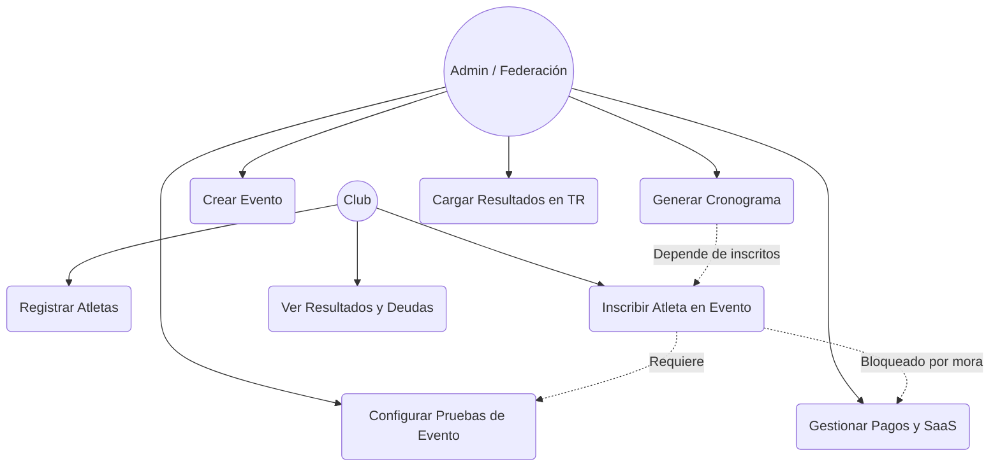

# Casos de Uso del Sistema: SportTrack

## 1. Diagrama General de Casos de Uso

A continuación se ilustra la interacción general entre los actores del sistema (Administrador/Federación y Club) y los principales módulos del software.

## 2. Especificación de Casos de Uso Principales

### CU-01: Configurar Pruebas de Evento
*   **Actor Principal:** Administrador (Federación).
*   **Descripción:** El administrador define las características de las carreras que se disputarán en un evento creado previamente.
*   **Precondiciones:** El usuario está logueado como Admin y existe al menos un evento en estado 'Activo' o 'Borrador'.
*   **Flujo Principal:**
    1. El Admin accede al panel de "Organizar Eventos".
    2. Selecciona un evento y hace clic en "Configurar Pruebas".
    3. El sistema muestra un modal para definir la prueba.
    4. El Admin ingresa la distancia (ej. 200m, 500m), tipo de embarcación (K1, K2, C1), rama (Masculino, Femenino) y categoría de edad.
    5. Guarda la configuración.
    6. El sistema valida los datos y registra la prueba en la base de datos.
*   **Postcondiciones:** La prueba está disponible para que los clubes inscriban a sus atletas.

### CU-02: Inscribir Atletas
*   **Actor Principal:** Representante del Club.
*   **Descripción:** Un club inscribe a sus atletas previamente registrados en las pruebas de un evento vigente.
*   **Precondiciones:** El club tiene su plan SaaS "Al día" (no está bloqueado por mora), y existen pruebas configuradas (CU-01).
*   **Flujo Principal:**
    1. El Club accede a su Dashboard y entra a "Inscripciones".
    2. El sistema lista las competencias futuras.
    3. El Club selecciona una competencia y luego a los atletas de su lista.
    4. El sistema valida que la edad y sexo del atleta coincidan con los permitidos por la prueba.
    5. El Club confirma la inscripción.
    6. El sistema genera un registro de inscripción pendiente de pago.
*   **Excepciones:** Si el club está bloqueado por falta de pago (SaaS vencido), el sistema emite una alerta y desactiva el botón de inscripción.

### CU-03: Generar Cronograma
*   **Actor Principal:** Administrador (Federación).
*   **Descripción:** El sistema calcula las series, semifinales y finales para todas las pruebas de un evento, calculando los intervalos (gaps) de salida.
*   **Precondiciones:** La etapa de inscripción al evento ha finalizado.
*   **Flujo Principal:**
    1. El Admin accede a "Motor de Cronograma" del evento.
    2. Inicia la generación automática.
    3. El sistema evalúa el número de inscritos por prueba.
    4. Según las reglas de la federación, el sistema asigna "Fases" (ej. si hay > 9 atletas, crea 2 eliminatorias y 1 final).
    5. El sistema asigna horarios calculando el "Gap Variable" según las distancias.
    6. El Admin revisa y aprueba el cronograma.
*   **Postcondiciones:** El cronograma es oficial y visible para todos los clubes.

### CU-04: Cargar Resultados en Tiempo Real
*   **Actor Principal:** Administrador (Juez de Llegada).
*   **Descripción:** Durante el evento, los jueces cargan los tiempos y las posiciones en tiempo real.
*   **Precondiciones:** El cronograma está generado y la prueba está en curso.
*   **Flujo Principal:**
    1. El Juez ingresa el tiempo/milisegundos y la posición de un atleta al cruzar la meta.
    2. El sistema guarda el resultado en la base de datos (`RESULTS`).
    3. El backend notifica vía SignalR a todos los clientes conectados.
    4. El frontend en las pantallas de los clubes actualiza la tabla de posiciones instantáneamente sin recargar la página.
