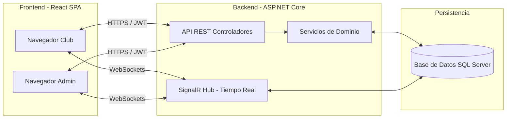
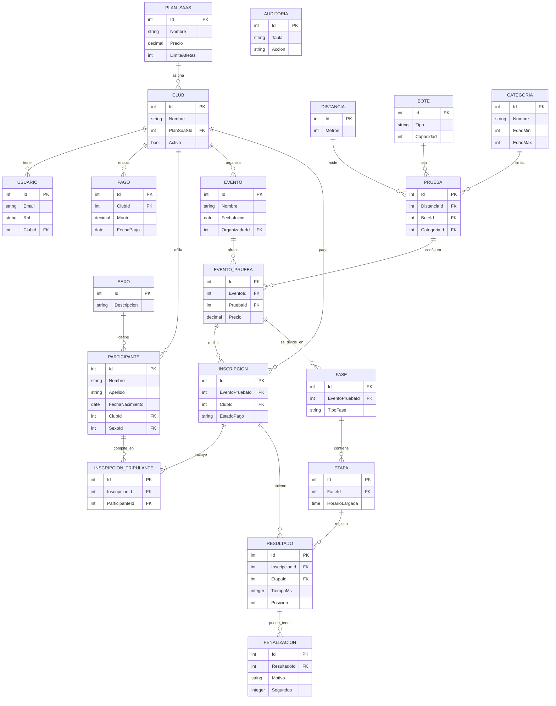

# Arquitectura y Diagramas del Sistema: SportTrack

## 1. Arquitectura de Despliegue y Tecnologías

SportTrack se construye utilizando una arquitectura moderna orientada a la nube, separando claramente la interfaz de usuario de las reglas de negocio, y permitiendo conectividad en tiempo real.

### Componentes Clave:
*   **React (Frontend):** Responsable de la visualización. Gestiona los estados locales y renderiza componentes mediante Vanilla CSS y recursos modernos (`lucide-react`).
*   **ASP.NET Core (Backend):** Arquitectura en capas que incluye Controladores (Endpoints), Servicios (Lógica de negocio como `SaaSService` y `SchedulerService`), y Entidades (Modelos de BD).
*   **SignalR:** Permite enviar resultados en vivo a los tableros del club a medida que los jueces cargan los datos en el sistema, sin que el cliente necesite refrescar (polling).

---

## 2. Diagrama de Clases (Base de Datos)

El siguiente modelo ilustra las entidades principales del sistema y sus relaciones. Este diagrama está optimizado desde el modelo conceptual y mapeado a la estructura transaccional (`Entity Framework Core`).

## 3. Lógica de Dominio y Reglas Clave

1.  **Motor de Cronogramas (`SchedulerService`):**
    *   Evalúa el número de inscritos en la tabla `REGISTRATIONS` para una `EVENT_TESTS`.
    *   Basado en la categoría y cantidad, genera "fases" (Series, Semifinales, Finales).
    *   Determina el `gap` de separación entre la largada de dos pruebas consecutivas.

2.  **Portal SaaS y Afiliaciones:**
    *   El acceso a realizar `REGISTRATIONS` se bloquea dinámicamente. El Frontend no guarda el estado estático de la deuda, sino que lo consulta (o calcula) combinando la validación del backend `activo && !bloqueadoPorFaltaDePago && !isExpired`.

3.  **Auditoría (`AUDIT_LOG`):**
    *   Toda modificación crítica en las inscripciones o configuración de pruebas genera un registro inmutable en el backend para control de fraudes.
