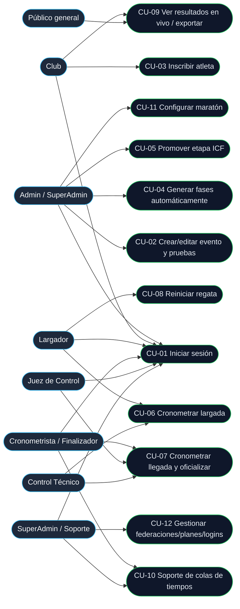

# 02 — Casos de Uso

**Proyecto:** SportTrack — Frontend de Competencias
**Última actualización: 2026-09-27**
**Notación:** UML (casos de uso) · Especificación de flujos según ISO/IEC/IEEE 29148

---

## Índice

1. [Introducción](#1-introducción)
2. [Diagrama de casos de uso](#2-diagrama-de-casos-de-uso)
3. [Catálogo de casos de uso](#3-catálogo-de-casos-de-uso)
4. [Especificación de casos de uso](#4-especificación-de-casos-de-uso)
   - [CU-01 — Iniciar sesión](#cu-01--iniciar-sesión)
   - [CU-02 — Crear / editar evento y configurar pruebas](#cu-02--crear--editar-evento-y-configurar-pruebas)
   - [CU-03 — Inscribir atleta](#cu-03--inscribir-atleta)
   - [CU-04 — Generar fases automáticamente](#cu-04--generar-fases-automáticamente)
   - [CU-05 — Promover etapa ICF](#cu-05--promover-etapa-icf)
   - [CU-06 — Cronometrar largada](#cu-06--cronometrar-largada)
   - [CU-07 — Cronometrar llegada y validar/officializar](#cu-07--cronometrar-llegada-y-validaroficializar)
   - [CU-08 — Reiniciar regata](#cu-08--reiniciar-regata)
   - [CU-09 — Consultar resultados en vivo y exportar PDF/CSV](#cu-09--consultar-resultados-en-vivo-y-exportar-pdfcsv)
   - [CU-10 — Consola de soporte de colas de tiempos](#cu-10--consola-de-soporte-de-colas-de-tiempos)
   - [CU-11 — Configurar maratón](#cu-11--configurar-maratón)
   - [CU-12 — Gestionar federaciones, planes y logins](#cu-12--gestionar-federaciones-planes-y-logins)
5. [Pie del pack](#pie-del-pack)

---

## 1. Introducción

Este documento especifica los casos de uso del frontend SportTrack. Cada caso de uso se identifica con `CU-##` y se vincula a los requerimientos funcionales del [documento 01](./01-Requerimientos-Usuario.md).

**Convención de actores:** se usa el rol tal como se muestra en la UI, aclarando en el encabezado el valor técnico cuando corresponde.

---

## 2. Diagrama de casos de uso

> Mermaid no posee un tipo de diagrama UML de casos de uso nativo; se representa con un `flowchart`. Los actores se modelan como nodos a la izquierda/derecha y los casos de uso como nodos ovalados (`([...])`).

---

## 3. Catálogo de casos de uso

| CU | Nombre | Actor principal | RF relacionados |
|----|--------|-----------------|-----------------|
| CU-01 | Iniciar sesión | Todos los autenticados | RF-57, RF-58, RF-60, RNF-12, RNF-13 |
| CU-02 | Crear / editar evento y configurar pruebas | Admin / SuperAdmin | RF-01…RF-06 |
| CU-03 | Inscribir atleta | Club / Admin | RF-07…RF-11 |
| CU-04 | Generar fases automáticamente | Admin / SuperAdmin | RF-12, RF-13, RF-14, RF-16, RF-18, RF-19 |
| CU-05 | Promover etapa ICF | Admin / SuperAdmin | RF-15 |
| CU-06 | Cronometrar largada | Largador / Control Técnico | RF-20, RF-25, RF-26 |
| CU-07 | Cronometrar llegada y validar/oficializar | Cronometrista / Juez de Control / Control Técnico | RF-21, RF-22, RF-23, RF-35, RF-36 |
| CU-08 | Reiniciar regata | Largador / Admin | RF-27 |
| CU-09 | Consultar resultados en vivo y exportar PDF/CSV | Público / Club / Admin | RF-33, RF-34, RF-54, RF-55 |
| CU-10 | Consola de soporte de colas de tiempos | Soporte / SuperAdmin | RF-30, RF-31, RF-56 |
| CU-11 | Configurar maratón | Admin / SuperAdmin | RF-37…RF-40 |
| CU-12 | Gestionar federaciones, planes y logins | SuperAdmin | RF-41…RF-45, RF-59 |

---

## 4. Especificación de casos de uso

### CU-01 — Iniciar sesión

| Campo | Valor |
|-------|-------|
| **ID** | CU-01 |
| **Actor(es)** | Todos los actores autenticados |
| **Objetivo** | Autenticar al usuario, resolver su rol y plan, y aterrizarlo en su panel. |
| **Precondiciones** | Usuario registrado y activo en la API. |
| **Postcondiciones** | Sesión iniciada con token en `localStorage`; plan restaurado; usuario redirigido a su panel por rol. |
| **RF** | RF-57, RF-58, RF-60 · RNF-12, RNF-13, RNF-15 |

**Flujo principal**

1. El usuario accede a `/login` e ingresa usuario y contraseña.
2. El sistema envía `POST /auth/login` con header `X-Client-App: sporttrack`.
3. La API valida credenciales y devuelve token, datos de usuario y plan; además setea la cookie `X-Access-Token`.
4. `AuthContext` normaliza el usuario y el plan (`normalizeAuthUser`, `normalizePlan`) y persiste token y datos en `localStorage`.
5. El sistema resuelve la ruta destino con `getDashboardPathForRole(rol)`.
6. El sistema redirige al panel correspondiente (`/super`, `/club`, `/juez-control`, `/jueces/largador`, `/jueces/llegada`, `/control-tecnico`).
7. Al reanudar, `AuthContext` valida la sesión contra `GET /auth/me` y restaura el plan.

**Flujos alternativos / excepciones**

- **A1 — Credenciales inválidas:** la API responde `401`; el sistema muestra el error y no inicia sesión.
- **A2 — Usuario inactivo:** la API rechaza; se muestra el mensaje correspondiente.
- **A3 — Sesión expirada:** ante un `401` en cualquier request, el interceptor limpia `USER_DATA` y `AUTH_TOKEN`; el usuario es redirigido a `/login`.
- **A4 — Rol sin plan compatible:** `ProtectedRoute` delega en `PlanGuard`, que muestra la pantalla de bloqueo.
- **A5 — Alias `soporte_tecnico`:** `isSuperAdminUser` lo trata como SuperAdmin y omite restricciones de plan.

---

### CU-02 — Crear / editar evento y configurar pruebas

| Campo | Valor |
|-------|-------|
| **ID** | CU-02 |
| **Actor(es)** | Admin / SuperAdmin |
| **Objetivo** | Dar de alta o modificar un evento y su grilla de pruebas/horarios. |
| **Precondiciones** | Sesión con rol Admin/SuperAdmin y acceso al sistema SportTrack. |
| **Postcondiciones** | Evento persistido; pruebas y horarios configurados; cronograma actualizado. |
| **RF** | RF-01…RF-06 |

**Flujo principal**

1. El Admin entra a *Eventos* y presiona "Nuevo evento".
2. Completa `EventForm` (nombre, fechas, ubicación, federación, estado de inscripciones) y guarda.
3. El sistema persiste vía `POST /eventos` y muestra el evento en la grilla (`GestionEventosSection`).
4. El Admin abre `ConfigurarPruebasModal` y agrega pruebas (categoría, bote, distancia, sexo), incluyendo múltiples categorías.
5. El sistema persiste las pruebas y genera el cronograma con horarios (`SchedulerService`).
6. El Admin ajusta horarios; `useResultados.handleUpdateFaseHorario` propaga el cambio con `FaseService.batchUpdate`.

**Flujos alternativos / excepciones**

- **A1 — Edición de fecha:** al cambiar la fecha del evento, el cronograma se recalcula sobre la nueva fecha.
- **A2 — Evento "todo manual":** al activarlo, se deshabilitan consolas de juez y se habilita la carga manual (`isManualTiming`).
- **A3 — Sin permiso de imágenes:** si el plan no habilita `permitirCargaImagenes`, la carga de imágenes queda deshabilitada.
- **A4 — Datos inválidos:** la validación del formulario impide guardar.

---

### CU-03 — Inscribir atleta

| Campo | Valor |
|-------|-------|
| **ID** | CU-03 |
| **Actor(es)** | Club (principal), Admin |
| **Objetivo** | Inscribir atletas/botes en una prueba de un evento. |
| **Precondiciones** | Evento con inscripciones abiertas; atleta perteneciente al club (o disponible). |
| **Postcondiciones** | Inscripción registrada; disponible para siembra y fases. |
| **RF** | RF-07…RF-11 |

**Flujo principal**

1. El Club entra a *Inscripciones* y busca el evento/prueba.
2. Abre `InscripcionAtletaModal` y selecciona el atleta o arma el bote de equipo con tripulantes.
3. `inscripcionEligibilityUtils` valida la elegibilidad.
4. El sistema envía `POST /inscripciones` (o `/inscripciones/registro`).
5. La inscripción aparece en la lista y queda disponible para siembra.
6. Si corresponde, se registra el pago (`RegistrarPagoModal` → `PagoService`).

**Flujos alternativos / excepciones**

- **A1 — Elegibilidad fallida:** el sistema rechaza la inscripción y explica el motivo.
- **A2 — Cupo/maxAtletas alcanzado:** el plan impone el límite (si no es `-1`).
- **A3 — Inscripciones cerradas:** la UI deshabilita la acción.

---

### CU-04 — Generar fases automáticamente

| Campo | Valor |
|-------|-------|
| **ID** | CU-04 |
| **Actor(es)** | Admin / SuperAdmin |
| **Objetivo** | Generar las etapas y series de un EventoPrueba con siembra de carriles. |
| **Precondiciones** | EventoPrueba con inscripciones confirmadas. |
| **Postcondiciones** | Fases creadas con series, carriles y progresión ICF lista. |
| **RF** | RF-12, RF-13, RF-14, RF-16, RF-17, RF-18, RF-19 |

**Flujo principal**

1. El Admin entra a la gestión de resultados del EventoPrueba.
2. El sistema muestra las inscripciones sin sembrar.
3. El Admin ejecuta "Generar fases" (`FaseService.generar` → `POST /fases/Generar/{id}`).
4. El motor de progresión (`ProgressionEngine`, `promotionHelpers`) reparte atletas en series y carriles.
5. Las `FaseCard` muestran las etapas generadas; el cronograma se actualiza.
6. El Admin puede editar horarios/carriles (`batchUpdate`) o eliminar una fase (`DELETE /fases/{id}`).

**Flujos alternativos / excepciones**

- **A1 — Generación manual:** `useResultados.handleGenerarManual` → `POST /fases/GenerarManual/{id}` con colocaciones explícitas.
- **A2 — Siembra insuficiente:** si hay menos inscripciones que carriles requeridos, el sistema ajusta las series.
- **A3 — Auditoría de progresión:** `GET /fases/ProgresionAudit/{id}` expone el detalle para revisión.

---

### CU-05 — Promover etapa ICF

| Campo | Valor |
|-------|-------|
| **ID** | CU-05 |
| **Actor(es)** | Admin / SuperAdmin |
| **Objetivo** | Promover los clasificados de una etapa a la siguiente según el reglamento ICF. |
| **Precondiciones** | Etapa con resultados cargados y validados. |
| **Postcondiciones** | Atletas clasificados asignados a la etapa siguiente; progresión auditable. |
| **RF** | RF-15 |

**Flujo principal**

1. El Admin abre la etapa finalizada (p. ej. Eliminatorias).
2. Ejecuta "Promover" (`FaseService.promover` → `POST /fases/Promover/{id}`).
3. El backend aplica la regla ICF de clasificación (primeros N por serie, mejores tiempos, repescas si aplica).
4. Los clasificados se asignan a la etapa siguiente; los demás quedan fuera.
5. El sistema registra la acción en la auditoría de progresión (`ProgressionAuditPage`).

**Flujos alternativos / excepciones**

- **A1 — Resultados incompletos:** si faltan tiempos, el sistema impide promover.
- **A2 — Empate en la última posición clasificatoria:** se aplica el criterio de desempate de la regla ICF.

---

### CU-06 — Cronometrar largada

| Campo | Valor |
|-------|-------|
| **ID** | CU-06 |
| **Actor(es)** | Largador (principal), Control Técnico |
| **Objetivo** | Registrar el t0 oficial de una regata y notificar a los conectados. |
| **Precondiciones** | Sesión con `accesoControlesLive`; serie en estado listo. |
| **Postcondiciones** | t0 registrado (o encolado); cronometrista notificado. |
| **RF** | RF-20, RF-25, RF-26 · RNF-11, RNF-14 |

**Flujo principal**

1. El Largador entra a `/jueces/largador` y selecciona el evento y la serie.
2. El sistema sincroniza el reloj (5 muestras, `GetServerTime`) y calcula `serverOffset`.
3. El Largador presiona "Largar"; se toma el instante del click como t0 (`getSyncedNow`).
4. `TimingSignalRService.deliverRaceStart` intenta: **SignalR** (`RequestStartRace`).
5. Si SignalR falla, cae a **HTTP** (`FaseService.iniciar`).
6. Si ambos fallan, se **encola** el t0 (`savePendingRaceStart`) y se reintenta cada 4 s.
7. El cronometrista recibe `RaceStarted` y se reproduce el timbre (`playRaceStartBell`).

**Flujos alternativos / excepciones**

- **A1 — Sin conexión:** se aplica el paso 6; el t0 nunca se regenera.
- **A2 — Evento global:** `globalRaceStarted` notifica a los suscriptores globales.
- **A3 — Largada "catch-up":** `isFreshRaceStart` evita reproducir el timbre al abrir una carrera antigua.

---

### CU-07 — Cronometrar llegada y validar/oficializar

| Campo | Valor |
|-------|-------|
| **ID** | CU-07 |
| **Actor(es)** | Cronometrista/Finalizador, Juez de Control, Control Técnico |
| **Objetivo** | Capturar tiempos de llegada, revisarlos y oficializarlos. |
| **Precondiciones** | Regata largada; resultados/inscripciones disponibles. |
| **Postcondiciones** | Resultados oficiales publicados en la pizarra pública. |
| **RF** | RF-21, RF-22, RF-23, RF-35, RF-36 · RNF-09, RNF-10 |

**Flujo principal**

1. El Cronometrista entra a `/jueces/llegada` y selecciona evento y serie.
2. Al recibir `RaceStarted`, el sistema habilita la captura y arranca el cronómetro.
3. Por cada carril, el Cronometrista registra el tiempo (`sendTime` / cola local).
4. Los tiempos se envían (`SendTime`) y se reflejan en la pizarra (`TimeReceived`).
5. La fase se marca "en revisión" (`RaceInReview`) mediante `enviarARevision`.
6. El Juez de Control revisa y oficializa (`updateResultStatus`); se emite `globalRaceOfficialized`.
7. La pizarra pública muestra los resultados oficiales.

**Flujos alternativos / excepciones**

- **A1 — Conexión caída:** los tiempos van a la cola local; puede descargarse el **PDF de respaldo**.
- **A2 — Tiempo pendiente en outbox:** Soporte lo confirma desde CU-10.
- **A3 — Corrección de tiempo:** el Juez de Control puede reabrir/editar antes de oficializar.
- **A4 — Carga manual:** en eventos "todo manual" o planes sin controles live se usa `ManualTiming` o la carga manual de resultados.

---

### CU-08 — Reiniciar regata

| Campo | Valor |
|-------|-------|
| **ID** | CU-08 |
| **Actor(es)** | Largador, Admin |
| **Objetivo** | Anular y repetir una regata por incidente operativo. |
| **Precondiciones** | Regata en curso o largada en falso. |
| **Postcondiciones** | Regata reiniciada; conectados notificados; motivo auditado. |
| **RF** | RF-27 · RN-10 |

**Flujo principal**

1. El Largador abre `ReiniciarFaseDialog` sobre la regata.
2. Selecciona una categoría de `REINICIAR_FASE_CATEGORIAS` (mala largada, postergación, problema técnico, problema externo, otro).
3. Si elige "Otro", ingresa un detalle de al menos 10 caracteres (`isReiniciarMotivoValid`).
4. Confirma el reinicio; el sistema llama `requestResetRace` (`RequestResetRace`).
5. Se emite el evento `RaceReset` a los conectados.
6. La serie vuelve a estado listo para una nueva largada.
7. La acción queda registrada en la auditoría.

**Flujos alternativos / excepciones**

- **A1 — Sin conexión:** el sistema informa que no hay conexión activa con el servidor de tiempos.
- **A2 — Motivo inválido:** "Otro" sin detalle suficiente bloquea la confirmación.
- **A3 — Uso indebido:** la UI recuerda con `REINICIAR_FASE_AVISO` que no debe usarse para corregir siembras ni cronograma.

---

### CU-09 — Consultar resultados en vivo y exportar PDF/CSV

| Campo | Valor |
|-------|-------|
| **ID** | CU-09 |
| **Actor(es)** | Público general, Club, Admin |
| **Objetivo** | Visualizar resultados en tiempo real y exportarlos. |
| **Precondiciones** | Evento existente. El acceso público **no** requiere login. |
| **Postcondiciones** | Resultados visualizados; archivo descargado si se solicita. |
| **RF** | RF-33, RF-34, RF-35, RF-54, RF-55 |

**Flujo principal**

1. El actor abre `/resultados/:id` (evento) o es dirigido desde un enlace compartido.
2. El sistema carga el evento y sus fases (`EventoService`, `FaseService`).
3. `TimingSignalRService` se conecta al grupo del evento y escucha `globalTimeReceived`, `globalRaceStarted`, `globalRaceInReview`, `globalRaceOfficialized`.
4. `resultadosHelpers.computePositionsForPhase` calcula posiciones y diferencias.
5. La tabla (`ResultadosTable`) se actualiza en tiempo real.
6. El actor exporta: `PdfExportService` (cronograma, programa, fase, start list, respaldo) o `CsvExportService`.

**Flujos alternativos / excepciones**

- **A1 — Evento maratón:** los resultados se agrupan por clasificación.
- **A2 — Sin conexión SignalR:** el sistema muestra el último estado cargado por REST y reintenta conectar.
- **A3 — Exportación no habilitada:** si el plan no incluye `exportacionPdf`, el botón no se ofrece.

---

### CU-10 — Consola de soporte de colas de tiempos

| Campo | Valor |
|-------|-------|
| **ID** | CU-10 |
| **Actor(es)** | SuperAdmin / Soporte técnico |
| **Objetivo** | Inspeccionar y resolver las colas temporales (outbox) de tiempos pendientes. |
| **Precondiciones** | Sesión SuperAdmin; existen entradas pendientes en el outbox del servidor. |
| **Postcondiciones** | Cola confirmada (consolidada) o descartada. |
| **RF** | RF-30, RF-31, RF-56 |

**Flujo principal**

1. Soporte entra a `SoporteSection` y abre la pestaña "Colas temporales".
2. El sistema consulta `SupportService.getTimingOutbox()` → `GET /support/timing-outbox`.
3. Se listan las entradas con su fase y usuario.
4. Soporte selecciona una entrada y presiona "Confirmar" → `POST /support/timing-outbox/{faseId}/commit`.
5. El sistema consolida los tiempos en la fase y recarga la cola con un toast de éxito.

**Flujos alternativos / excepciones**

- **A1 — Descartar:** `DELETE /support/timing-outbox/{id}` previa confirmación (`ConfirmDialog`).
- **A2 — Error de carga:** se muestra toast de error y se permite reintentar.

---

### CU-11 — Configurar maratón

| Campo | Valor |
|-------|-------|
| **ID** | CU-11 |
| **Actor(es)** | Admin / SuperAdmin |
| **Objetivo** | Configurar un evento en modalidad maratón y generar su largada masiva. |
| **Precondiciones** | Evento creado con inscripciones agrupables. |
| **Postcondiciones** | Fase "Largada" de maratón creada; programa/start list disponible. |
| **RF** | RF-37…RF-40 · RN-13 |

**Flujo principal**

1. El Admin abre `ConfigurarMaratonModal`.
2. Define los grupos y la configuración de largada.
3. Selecciona los EventoPrueba que participan.
4. El sistema llama `FaseService.generarLargadaMaraton` → `POST /fases/GenerarLargadaMaraton`.
5. Se crea una fase "Largada" con todos los inscriptos del grupo.
6. `maratonStartListUtils` y `MaratonProgramaList` arman el programa/start list.
7. El Admin exporta el programa con `exportProgramaMaraton` / `exportMaratonLargadaStartList`.

**Flujos alternativos / excepciones**

- **A1 — Sin inscriptos:** el sistema impide generar la largada.
- **A2 — Resultados:** `groupMaratonResultadosByClasificacion` agrupa los resultados por clasificación.
- **A3 — Cronograma:** `maratonScheduleUtils` calcula los horarios de la modalidad.

---

### CU-12 — Gestionar federaciones, planes y logins

| Campo | Valor |
|-------|-------|
| **ID** | CU-12 |
| **Actor(es)** | SuperAdmin |
| **Objetivo** | Administrar el SaaS: federaciones, clubes, planes y usuarios. |
| **Precondiciones** | Sesión SuperAdmin (o alias `soporte_tecnico`). |
| **Postcondiciones** | Federaciones/clubes/planes/logins actualizados; accesos coherentes con el plan. |
| **RF** | RF-41…RF-45, RF-59 |

**Flujo principal**

1. El SuperAdmin entra a `GestionFederacionesSection` y administra federaciones (`FederacionService`).
2. En `SaaSManagement` asigna planes y consulta estado/métricas (`SaaSService`).
3. Activa/desactiva clubes (`/saas/clubes/{id}/toggle-activo`).
4. En `GestionLoginsSection` crea usuarios por rol; el sistema valida el plan:
   - login de club → requiere `accesoDashboardClub`;
   - login de juez → requiere `accesoControlesLive`.
5. El sistema persiste el rol (`rolFederacion`) y sus permisos por evento.

**Flujos alternativos / excepciones**

- **A1 — Plan insuficiente:** no se ofrece crear el login correspondiente.
- **A2 — Club sin federación:** el registro de un login de club requiere club válido (RN-07).
- **A3 — Backup:** desde `BackupsSection` se ejecutan respaldos (`BackupService`).

---

## Pie del pack

| Documento anterior | Documento actual | Documento siguiente |
|--------------------|------------------|---------------------|
| [← 01 Requerimientos](./01-Requerimientos-Usuario.md) | **02 — Casos de Uso** | [03 — Diagramas de Flujo →](./03-Diagramas-de-Flujo.md) |

[README](./README.md) · [01](./01-Requerimientos-Usuario.md) · [02](./02-Casos-de-Uso.md) · [03](./03-Diagramas-de-Flujo.md) · [04](./04-Manual-de-Usuario.md) · [05](./05-Manual-Tecnico.md) · [06](./06-Manual-Instalacion-Despliegue.md)
