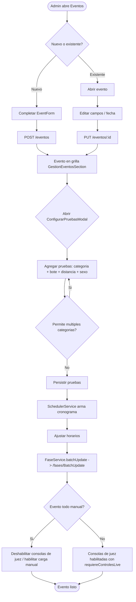
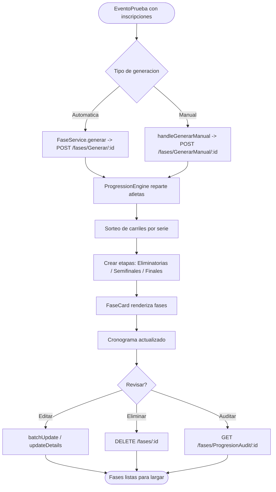
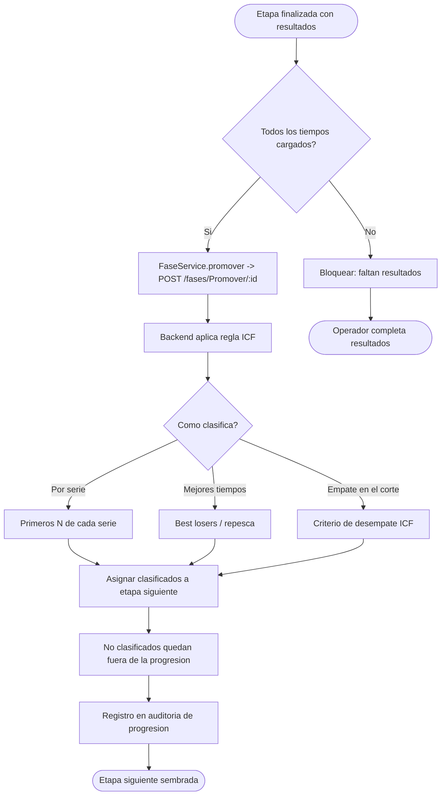
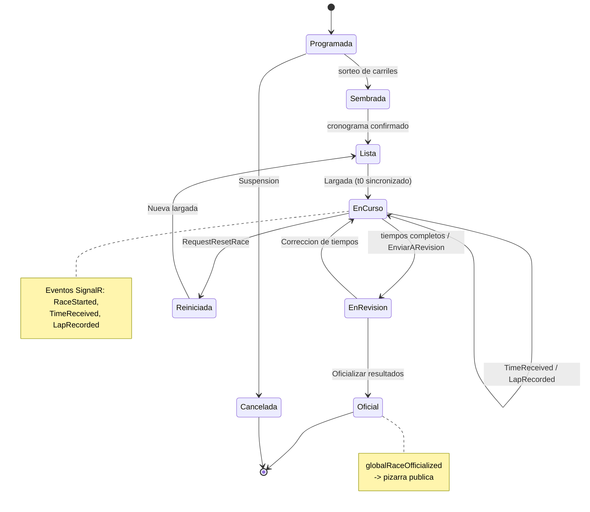
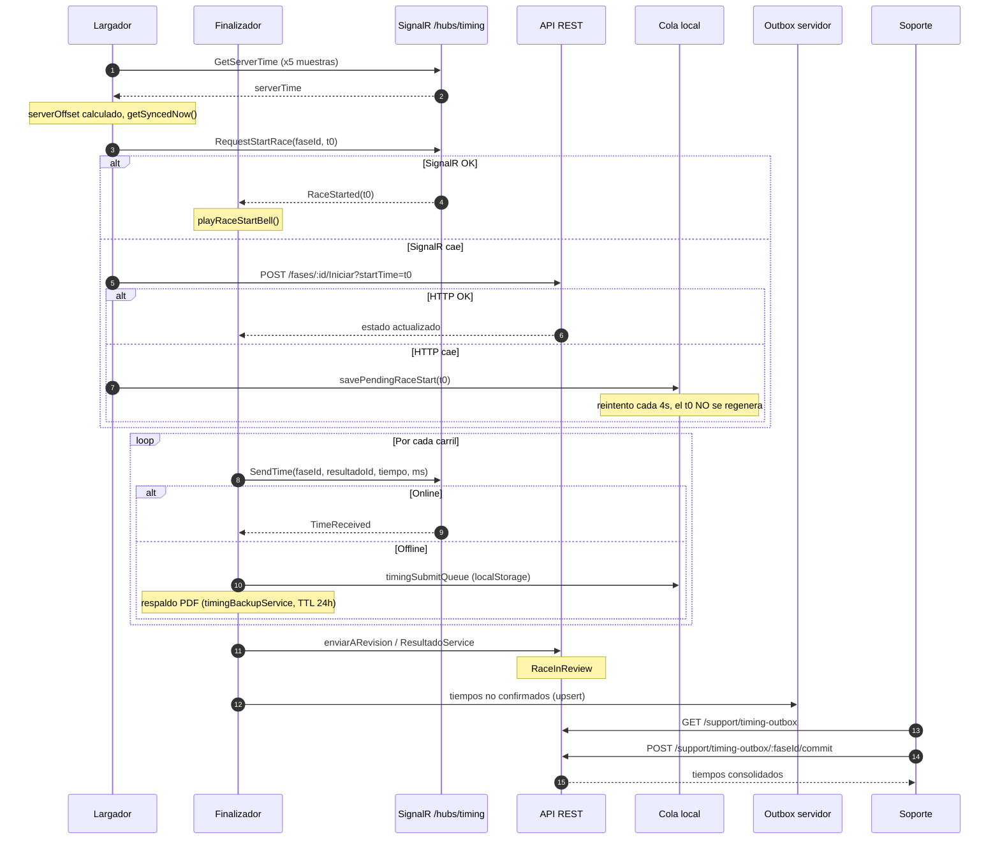
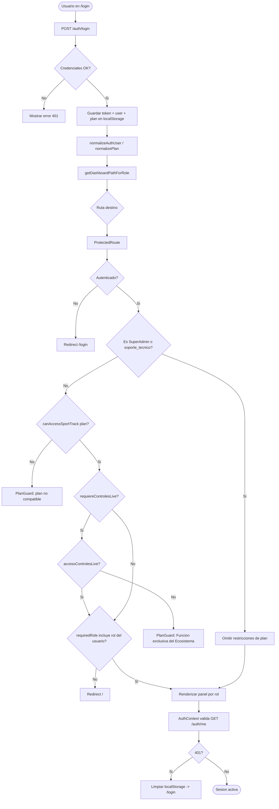
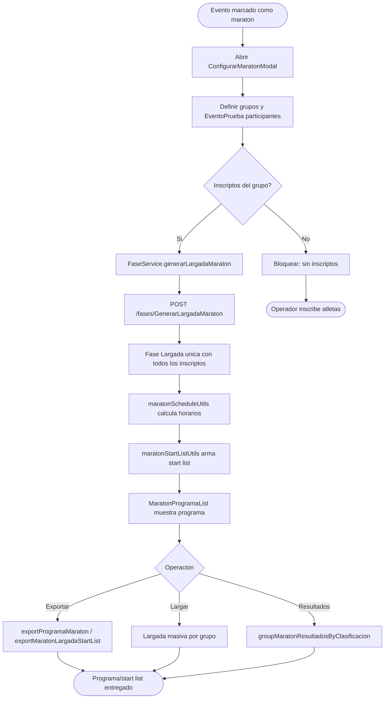
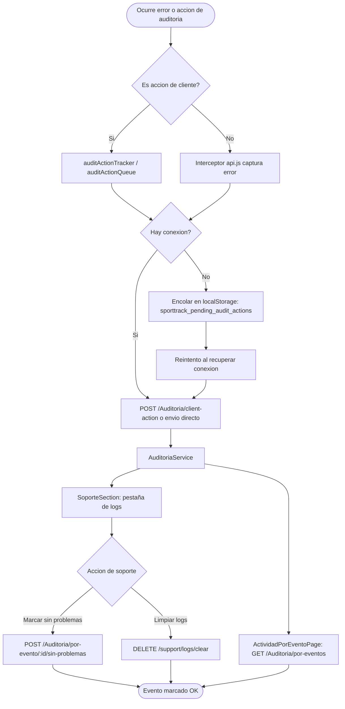

# 03 — Diagramas de Flujo

**Proyecto:** SportTrack — Frontend de Competencias
**Última actualización: 2026-09-27**
**Notación:** Mermaid (`flowchart`, `stateDiagram-v2`, `sequenceDiagram`)

---

## Índice

1. [Introducción](#1-introducción)
2. [(a) Alta/edición de evento y configuración de pruebas](#a-altaedición-de-evento-y-configuración-de-pruebas)
3. [(b) Siembra/sorteo y generación de fases](#b-siembrasorteo-y-generación-de-fases)
4. [(c) Progresión ICF](#c-progresión-icf)
5. [(d) Ciclo de vida de una regata](#d-ciclo-de-vida-de-una-regata)
6. [(e) Cronometraje con resiliencia offline](#e-cronometraje-con-resiliencia-offline)
7. [(f) Autenticación/autorización por rol y plan](#f-autenticaciónautorización-por-rol-y-plan)
8. [(g) Flujo maratón](#g-flujo-maratón)
9. [(h) Auditoría de incidencias/errores](#h-auditoría-de-incidenciaserrores)
10. [Pie del pack](#pie-del-pack)

---

## 1. Introducción

Este documento presenta los flujos operativos y técnicos principales del frontend SportTrack mediante diagramas Mermaid reproducibles. Cada diagrama se vincula con los requerimientos ([doc 01](./01-Requerimientos-Usuario.md)) y los casos de uso ([doc 02](./02-Casos-de-Uso.md)).

> Los diagramas son **válidos** para el renderizador Mermaid de GitHub/VSCode. Para copiarlos, usá el bloque completo incluido el encabezado del tipo de diagrama.

---

## (a) Alta/edición de evento y configuración de pruebas

> **RF:** RF-01…RF-06 · **CU:** CU-02

**Notas.** La edición de la fecha del evento recalcula el cronograma. La carga de imágenes depende del flag `permitirCargaImagenes` del plan.

---

## (b) Siembra/sorteo y generación de fases

> **RF:** RF-12, RF-13, RF-14 · **CU:** CU-04

---

## (c) Progresión ICF

> **RF:** RF-15, RF-19 · **CU:** CU-05 · Reglamento ICF de canotaje sprint.

**Notas.** La progresión se ejecuta en el backend; el frontend solo la dispara y muestra el resultado y su auditoría.

---

## (d) Ciclo de vida de una regata

> **RF:** RF-20, RF-21, RF-22, RF-27 · **CU:** CU-06, CU-07, CU-08

---

## (e) Cronometraje con resiliencia offline

> **RF:** RF-25, RF-28, RF-29, RF-30, RF-31, RF-32 · **CU:** CU-06, CU-07, CU-10

**Notas.** El outbox del servidor (`/timing-outbox/*`) y la consola de Soporte permiten recuperar capturas que no llegaron a tiempo. La cola local (`sporttrack_pending_timing_saves`) y el respaldo PDF cubren el caso extremo de corte prolongado.

---

## (f) Autenticación/autorización por rol y plan

> **RF:** RF-45, RF-57, RF-58 · **RNF:** RNF-12, RNF-13 · **CU:** CU-01, CU-12

---

## (g) Flujo maratón

> **RF:** RF-37…RF-40 · **CU:** CU-11

---

## (h) Auditoría de incidencias/errores

> **RF:** RF-46…RF-49 · **CU:** CU-12 · **RNF:** RNF-15, RNF-21

---

## Pie del pack

| Documento anterior | Documento actual | Documento siguiente |
|--------------------|------------------|---------------------|
| [← 02 Casos de Uso](./02-Casos-de-Uso.md) | **03 — Diagramas de Flujo** | [04 — Manual de Usuario →](./04-Manual-de-Usuario.md) |

[README](./README.md) · [01](./01-Requerimientos-Usuario.md) · [02](./02-Casos-de-Uso.md) · [03](./03-Diagramas-de-Flujo.md) · [04](./04-Manual-de-Usuario.md) · [05](./05-Manual-Tecnico.md) · [06](./06-Manual-Instalacion-Despliegue.md)
