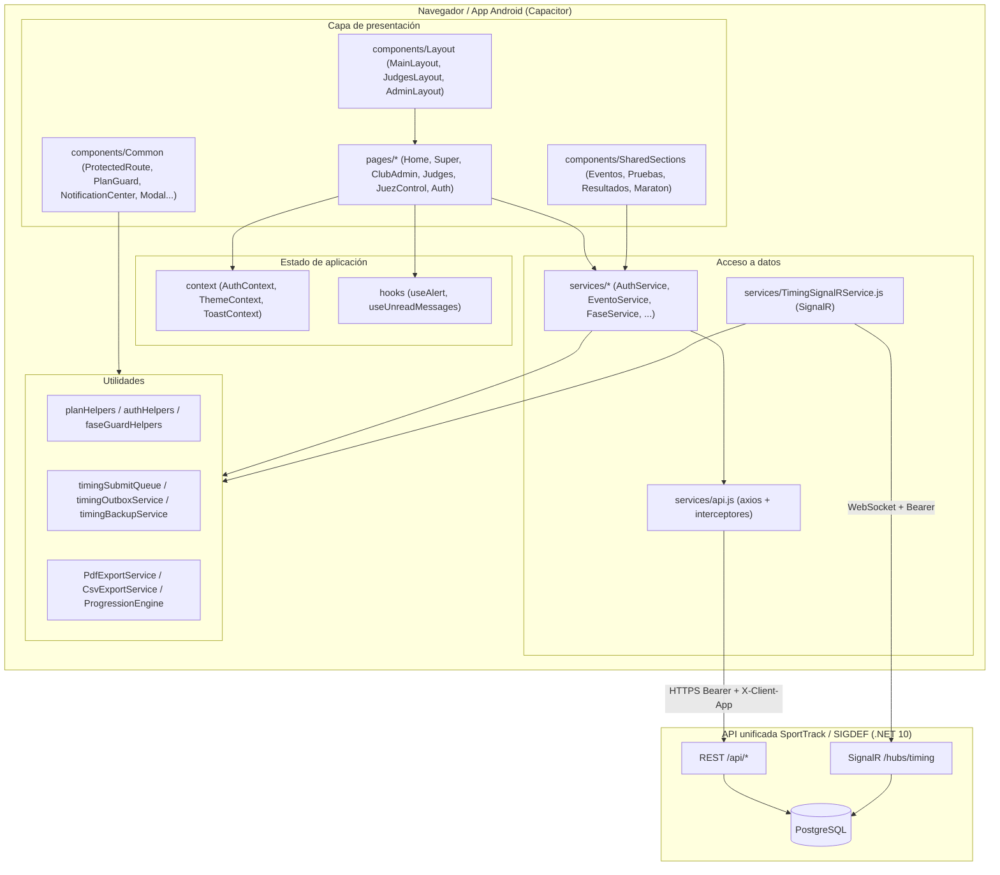

# 05 — Manual Técnico

**Proyecto:** SportTrack — Frontend de Competencias
**Última actualización: 2026-09-27**
**Audiencia:** desarrolladores, DevOps y soporte técnico

---

## Índice

1. [Introducción y alcance](#1-introducción-y-alcance)
2. [Arquitectura general](#2-arquitectura-general)
3. [Stack y versiones reales](#3-stack-y-versiones-reales)
4. [Estructura del código](#4-estructura-del-código)
5. [Módulos y servicios](#5-módulos-y-servicios)
6. [Contratos de API consumidos](#6-contratos-de-api-consumidos)
7. [SignalR: métodos y eventos](#7-signalr-métodos-y-eventos)
8. [Estado y almacenamiento local](#8-estado-y-almacenamiento-local)
9. [Planes SaaS y guards](#9-planes-saas-y-guards)
10. [Estrategia offline-first](#10-estrategia-offline-first)
11. [Seguridad](#11-seguridad)
12. [Build y entornos](#12-build-y-entornos)
13. [Despliegue](#13-despliegue)
14. [Mantenimiento y troubleshooting](#14-mantenimiento-y-troubleshooting)
15. [Deuda técnica](#15-deuda-técnica)
16. [Pie del pack](#pie-del-pack)

---

## 1. Introducción y alcance

Este manual describe la arquitectura, el stack, la organización del código, los contratos de integración y las prácticas de operación del frontend **SportTrack-Front**, verificado contra el repositorio. No documenta la implementación del backend (`SportTrack-Sigdef`, ASP.NET Core **.NET 10** + PostgreSQL).

---

## 2. Arquitectura general

La SPA se organiza en capas: **presentación (pages/components)**, **estado de aplicación (context/hooks)**, **acceso a datos (services)** y **utilidades puras (utils)**. Se comunica con la API unificada por REST (axios) y por WebSockets (SignalR).



### 2.1 Flujo de una petición

1. Un componente llama a un método de servicio (p. ej. `EventoService.getAll()`).
2. El servicio usa la instancia axios de `api.js`.
3. El interceptor de request inyecta `Authorization: Bearer <token>` y `X-Client-App: sporttrack`.
4. El interceptor de response normaliza errores (`getUserFacingError`) y, ante `401`, limpia el almacenamiento local.
5. El componente actualiza su estado y renderiza.

---

## 3. Stack y versiones reales

> Verificado contra `package.json` (versión del proyecto `1.0.0`).

### 3.1 Runtime y framework

| Componente | Paquete | Versión |
|-----------|---------|---------|
| Biblioteca UI | `react` / `react-dom` | `^18.3.1` |
| Ruteo | `react-router-dom` | `^6.26.2` |
| Bundler / dev server | `vite` | `^5.4.10` |
| Plugin React para Vite | `@vitejs/plugin-react` | `^4.3.3` |
| Tipos | `@types/react`, `@types/react-dom` | `^18.3.x` |

### 3.2 Datos, tiempo real y reportes

| Componente | Paquete | Versión |
|-----------|---------|---------|
| HTTP | `axios` | `^1.7.7` |
| Tiempo real | `@microsoft/signalr` | `^8.0.7` |
| PDF | `jspdf` | `^4.2.1` |
| PDF (tablas) | `jspdf-autotable` | `^5.0.7` |
| Hashing | `bcryptjs` | `^3.0.3` |

### 3.3 Maps y UI

| Componente | Paquete | Versión |
|-----------|---------|---------|
| Mapas | `react-simple-maps` | `^3.0.0` |
| Geo | `d3-geo` | `^3.1.1` |
| TopoJSON | `topojson-client` | `^3.1.0` |
| Iconos | `lucide-react` | `^1.8.0` |

### 3.4 Móvil (Capacitor)

| Componente | Paquete | Versión |
|-----------|---------|---------|
| Core | `@capacitor/core` | `7.6.8` |
| Android | `@capacitor/android` | `7.6.8` |
| CLI | `@capacitor/cli` | `7.6.8` |
| Keyboard | `@capacitor/keyboard` | `^7.0.6` |
| Status Bar | `@capacitor/status-bar` | `^7.0.6` |

### 3.5 Scripts de `package.json`

| Script | Comando | Uso |
|--------|---------|-----|
| `dev` | `vite` | Servidor de desarrollo |
| `build` | `vite build` | Build de producción web |
| `preview` | `vite preview` | Previsualización del build |
| `build:android` | `vite build --mode capacitor && npx cap sync android` | Build + sincronización Android |
| `open:android` | `npx cap open android` | Abrir el proyecto Android |

---

## 4. Estructura del código

```
SportTrack-Front/
├─ capacitor.config.json      # Config de la app Android (appId com.sporttrack.jueces)
├─ vite.config.js             # Alias @, proxy /api y /hubs, base para capacitor
├─ .env.example               # Plantilla de variables de entorno
├─ index.html
└─ src/
   ├─ assets/                 # Recursos estáticos
   ├─ config/                 # adminNavItems.jsx (navegación del panel admin)
   ├─ context/                # AuthContext, ThemeContext, ToastContext
   ├─ hooks/                  # useAlert, useUnreadMessages
   ├─ components/
   │  ├─ Common/              # ProtectedRoute, PlanGuard, NotificationCenter, Modal,
   │  │                       #   ConfirmDialog, ReiniciarFaseDialog, ToastContainer,
   │  │                       #   WorldGlobe, EventAuditCards, ProgressionAudit...
   │  ├─ Layout/              # MainLayout, JudgesLayout, AdminLayout, Navbar, Sidebar, AppFooter
   │  └─ SharedSections/      # GestionEventosSection, ConfigurarPruebasModal, EventForm,
   │                          #   PruebaForm, FaseCard, ResultadosTable, useResultados.js,
   │                          #   ConfigurarMaratonModal, maraton/*
   ├─ pages/
   │  ├─ Home/                # Home, LiveResults, PlanDetails
   │  ├─ Auth/                # Login
   │  ├─ Super/               # Dashboard, AdminHome, sections/*
   │  ├─ ClubAdmin/           # Dashboard, sections/*
   │  ├─ Judges/              # JudgesDashboard, StarterDashboard, FinisherDashboard, ManualTiming
   │  ├─ JuezControl/         # JuezControlDashboard
   │  └─ Shared/              # Mensajes, CampanaDetalle, DestinatariosMultiSelect
   ├─ services/               # 30 servicios (ver §5)
   └─ utils/                  # 32 utilidades (helpers de plan, auth, timing, PDF, etc.)
```

### 4.1 Puntos de entrada clave

| Archivo | Rol |
|---------|-----|
| `src/main.jsx` | Bootstrap de React, providers globales. |
| `src/App.jsx` | Definición de rutas y guards. |
| `src/services/api.js` | Cliente axios y interceptores. |
| `src/utils/constants.js` | `API_BASE_URL`, `ENDPOINTS`, `STORAGE_KEYS`, `APP_NAME`. |

---

## 5. Módulos y servicios

### 5.1 Servicios HTTP (`src/services/`)

| Servicio | Responsabilidad |
|----------|-----------------|
| `api.js` | Instancia axios, interceptores de request/response, `X-Client-App`, manejo de 401. |
| `AuthService` | Login, registro, usuarios, perfil, logout, `validateSession` (`/auth/me`). |
| `EventoService` | CRUD de eventos y consulta por club/federación. |
| `FaseService` | Fases: generar, generar manual, promover, iniciar, finalizar, reiniciar, revisión, batch update, auditoría de progresión. |
| `ResultadoService` | Batch update de resultados y resultados por fase. |
| `InscripcionService` | Alta, edición, borrado y toggle de siembra de inscripciones. |
| `ParticipanteService` | Alta/edición de participantes (atletas). |
| `ClubService` | CRUD de clubes. |
| `FederacionService` | Listado/consulta de federaciones (con normalización). |
| `ConfigService` | Pruebas, categorías, botes, distancias y asignación de pruebas a eventos. |
| `SaaSService` | Planes, asignar plan, status de clubes, toggle activo, métricas, federaciones. |
| `PagoService` | Historial de pagos, registro y toggles de `alDia`/`pagado`. |
| `MessageService` | Hilos, campañas, responder, marcar leído, contador de no leídos. |
| `AuditoriaService` | Logs de auditoría, por eventos, acciones de cliente. |
| `SupportService` | Logs de soporte y colas temporales de tiempos (outbox). |
| `BackupService` | Descarga e historial de backups. |
| `TelemetryService` | Envío de errores de frontend. |
| `AudienceService` | Métricas de audiencia en vivo, picos y capacidad. |
| `SignalRService` | **Obsoleto** (`@deprecated`); conservado por compatibilidad. Usar `TimingSignalRService`. |
| `TimingSignalRService` | Conexión SignalR de tiempos, sincronización de reloj, envío de tiempos y largadas. |
| `timingSubmitQueue` | Cola local de envío de tiempos con `timingBackupService` y `auditActionQueue`. |
| `timingOutboxService` | Cliente del outbox de tiempos en el servidor. |
| `timingBackupService` | Persistencia del respaldo local de tiempos (TTL 24 h). |
| `timingAuditRepair` | Reparación/registro de auditoría de timing. |
| `auditActionQueue` / `auditActionTracker` | Encolado y seguimiento de acciones de auditoría. |
| `PdfExportService` | Exportación PDF (fase, grupo, prueba, start list maratón, cronogramas, programa, respaldo). |
| `CsvExportService` | Exportación CSV. |
| `SchedulerService` | Motor/armado de cronograma. |

### 5.2 Utilidades destacadas (`src/utils/`)

| Utilidad | Responsabilidad |
|----------|-----------------|
| `constants.js` | `ENDPOINTS`, `STORAGE_KEYS`, `API_BASE_URL`, `PUBLIC_APP_URL`, `liveResultsUrl`. |
| `planHelpers.js` | Normalización y flags de planes SaaS; `canAccess*`. |
| `authHelpers.js` | Rol, normalización de usuario, alias `soporte_tecnico`, ruta por rol, búsqueda. |
| `faseGuardHelpers.js` | Guardas de fases por rol/estado. |
| `controlTecnico.js` | Lógica de permisos de control técnico. |
| `ProgressionEngine.js` | Construcción de la traza de progresión de cada atleta. |
| `promotionHelpers.js` | Apoyo a la promoción ICF. |
| `resultadosHelpers.js` | Cálculo de posiciones por fase. |
| `raceTimeUtils.js` | Formateo y conversión de tiempos de carrera. |
| `timingMath.js` | Sincronización de reloj y largada (`getSyncedNow`, `pendingRaceStart`). |
| `raceStartBell.js` | Timbre de largada vía Web Audio API. |
| `reiniciarFaseConstants.js` | Categorías, aviso y validación del reinicio de regata. |
| `maratonScheduleUtils.js` / `maratonStartListUtils.js` | Horarios y armado de start list de maratón. |
| `notificationHelpers.js` | Metadatos, agrupación y mapeo de notificaciones. |
| `apiHelpers.js` | Normalización de respuestas de API. |
| `userFacingError.js` | Traducción de errores a mensajes de usuario. |
| `tokenUtils.js` | Decodificación JWT y verificación de expiración. |
| `deviceUtils.js` | Parseo de User-Agent para la auditoría de dispositivo. |

---

## 6. Contratos de API consumidos

> Todas las rutas se resuelven sobre `API_BASE_URL` (`/api`). La columna **Rol** indica el actor que típicamente consume el endpoint en el frontend.

### 6.1 Autenticación (`AuthService`)

| Método | Ruta | Rol | Descripción |
|--------|------|-----|-------------|
| POST | `/auth/login` | Público | Inicio de sesión; devuelve token + usuario + plan. |
| POST | `/auth/register` | Admin/SuperAdmin | Alta de usuario. |
| GET | `/auth/me` | Autenticado | Validación de sesión. |
| GET | `/auth/usuarios` | Admin/SuperAdmin | Listado de usuarios. |
| PUT | `/auth/usuarios/{id}/password` | Admin/SuperAdmin | Cambio de contraseña. |
| PUT | `/auth/usuarios/{id}/perfil` | Autenticado | Edición de perfil. |
| PATCH | `/auth/usuarios/{id}/toggle-activo` | Admin/SuperAdmin | Activar/desactivar usuario. |
| DELETE | `/auth/usuarios/{id}` | Admin/SuperAdmin | Eliminar usuario. |
| POST | `/auth/logout` | Autenticado | Cierre de sesión. |

### 6.2 Eventos (`EventoService`)

| Método | Ruta | Rol | Descripción |
|--------|------|-----|-------------|
| GET | `/eventos?clubId=&federacionId=` | Autenticado | Listado de eventos por alcance. |
| GET | `/eventos/proximos?...` | Autenticado/Público | Próximos eventos. |
| POST | `/eventos` | Admin/SuperAdmin | Crear evento. |
| GET | `/eventos/{id}` | Autenticado/Público | Detalle de evento. |
| PUT | `/eventos/{id}` | Admin/SuperAdmin | Editar evento. |
| DELETE | `/eventos/{id}` | Admin/SuperAdmin | Eliminar evento. |
| PUT | `/eventos/pruebas/{eventoPruebaId}` | Admin/SuperAdmin | Editar una prueba asignada. |

### 6.3 Pruebas y catálogos (`ConfigService`)

| Método | Ruta | Rol | Descripción |
|--------|------|-----|-------------|
| GET | `/eventos/{eventoId}/pruebas` | Autenticado | Pruebas de un evento. |
| POST | `/eventos/{eventoId}/pruebas` | Admin/SuperAdmin | Asignar prueba a evento. |
| POST | `/eventos/{eventoId}/pruebas/largada` | Admin/SuperAdmin | Prueba de largada. |
| PUT | `/eventos/pruebas/{assignId}` | Admin/SuperAdmin | Editar prueba asignada. |
| DELETE | `/eventos/pruebas/{assignId}` | Admin/SuperAdmin | Quitar prueba. |
| GET | `/pruebas` | Autenticado | Catálogo de pruebas. |
| POST | `/pruebas` | Admin/SuperAdmin | Crear prueba. |
| GET | `/botes`, `/categorias`, `/distancias` | Autenticado | Catálogos maestros. |

### 6.4 Inscripciones (`InscripcionService`)

| Método | Ruta | Rol | Descripción |
|--------|------|-----|-------------|
| POST | `/inscripciones` | Club/Admin | Crear inscripción. |
| POST | `/inscripciones/registro` | Club/Admin | Registro de inscripción. |
| GET | `/inscripciones/evento-prueba/{id}` | Autenticado | Inscripciones por EventoPrueba. |
| GET | `/inscripciones/evento/{eventoId}/club/{clubId}` | Club/Admin | Inscripciones por evento y club. |
| PUT | `/inscripciones/{id}` | Club/Admin | Editar inscripción. |
| DELETE | `/inscripciones/{id}` | Club/Admin | Eliminar inscripción. |
| PATCH | `/inscripciones/{id}/toggle-seeding` | Admin | Habilitar/deshabilitar siembra. |

### 6.5 Fases (`FaseService`)

| Método | Ruta | Rol | Descripción |
|--------|------|-----|-------------|
| GET | `/fases/EventoPrueba/{id}` | Admin/Operadores | Fases de un EventoPrueba. |
| POST | `/fases/Generar/{id}` | Admin/SuperAdmin | Generar fases automáticamente. |
| POST | `/fases/GenerarManual/{id}` | Admin/SuperAdmin | Generar fases manualmente. |
| POST | `/fases/GenerarLargadaMaraton` | Admin/SuperAdmin | Generar largada de maratón. |
| POST | `/fases/Promover/{id}` | Admin/SuperAdmin | Promover etapa ICF. |
| GET | `/fases/ProgresionAudit/{id}` | Admin/SuperAdmin | Auditoría de progresión. |
| POST | `/fases/BatchUpdate` | Admin/SuperAdmin | Actualización masiva de fases. |
| PUT | `/fases/{id}/details` | Admin/SuperAdmin | Editar detalles de fase. |
| POST | `/fases/{id}/Iniciar?startTime=` | Largador/Admin | Iniciar regata (t0). |
| POST | `/fases/{id}/Finalizar` | Cronometrista/Admin | Finalizar regata. |
| POST | `/fases/{id}/Reiniciar` | Largador/Admin | Reiniciar regata (motivo, categoría). |
| POST | `/fases/{id}/EnviarARevision` | Cronometrista/Admin | Enviar a revisión. |
| DELETE | `/fases/{id}` | Admin/SuperAdmin | Eliminar fase. |
| GET | `/eventos/{id}/fases` | Autenticado | Fases de un evento. |

### 6.6 Resultados (`ResultadoService`)

| Método | Ruta | Rol | Descripción |
|--------|------|-----|-------------|
| PUT | `/resultados/BatchUpdate` | JuezControl/Admin | Actualización masiva de resultados. |
| GET | `/resultados/Fase/{id}` | Autenticado/Público | Resultados de una fase. |

### 6.7 Outbox de tiempos (`timingOutboxService`)

| Método | Ruta | Rol | Descripción |
|--------|------|-----|-------------|
| POST | `/timing-outbox` | Cronometrista | Upsert de entrada pendiente. |
| GET | `/timing-outbox/pending` | Cronometrista/Soporte | Listar pendientes. |
| POST | `/timing-outbox/flush` | Cronometrista | Reintentar envío. |
| POST | `/timing-outbox/{faseId}/commit` | Cronometrista/Soporte | Consolidar tiempos. |
| DELETE | `/timing-outbox/{faseId}` | Cronometrista/Soporte | Eliminar entrada. |

### 6.8 SaaS y federaciones (`SaaSService`)

| Método | Ruta | Rol | Descripción |
|--------|------|-----|-------------|
| GET | `/SaaS/planes` | Admin/SuperAdmin | Planes disponibles. |
| POST | `/SaaS/asignar-plan?clubId=&planId=` | SuperAdmin | Asignar plan a club. |
| GET | `/SaaS/clubes-status` | SuperAdmin | Estado de clubes. |
| PATCH | `/SaaS/clubes/{clubId}/toggle-activo` | SuperAdmin | Activar/desactivar club. |
| POST | `/SaaS/create-federacion` | SuperAdmin | Crear federación. |
| PUT | `/Federaciones/{id}` | SuperAdmin | Editar federación. |
| DELETE | `/Federaciones/{id}` | SuperAdmin | Eliminar federación. |
| GET | `/SaaS/global-metrics` | SuperAdmin | Métricas globales. |
| GET | `/federaciones`, `/federaciones/{id}` | Autenticado | Consulta de federaciones. |

### 6.9 Clubes, participantes y pagos

| Método | Ruta | Rol | Descripción |
|--------|------|-----|-------------|
| GET | `/clubes`, `/clubes/{id}` | Autenticado | Clubes. |
| POST/PUT/DELETE | `/clubes` · `/clubes/{id}` | Admin/SuperAdmin | Gestión de clubes. |
| GET/PUT/DELETE | `/participantes/{id}` | Club/Admin | Gestión de participantes. |
| GET | `/participantes/club/{clubId}` | Club/Admin | Atletas por club. |
| GET | `/pagos/historial` | Admin/SuperAdmin | Historial de pagos. |
| POST | `/pagos/registrar` | Club/Admin | Registrar pago. |
| PUT | `/pagos/clubes/{clubId}/toggle` | Admin | Estado de pago del club. |
| PUT | `/pagos/atletas/{atletaId}/toggle` | Admin | Estado de pago del atleta. |
| PUT | `/pagos/inscripciones/{id}/toggle` | Admin | Estado de pago de inscripción. |

### 6.10 Mensajería (`MessageService`)

| Método | Ruta | Rol | Descripción |
|--------|------|-----|-------------|
| GET | `/mensajes/hilos` | Autenticado | Listar hilos. |
| GET | `/mensajes/hilos/{id}` | Autenticado | Detalle de hilo. |
| POST | `/mensajes/hilos` | Autenticado | Crear hilo. |
| POST | `/mensajes/hilos/masivo` | Admin/SuperAdmin | Envío masivo. |
| GET | `/mensajes/campanas`, `/mensajes/campanas/{id}` | Admin/SuperAdmin | Campañas. |
| POST | `/mensajes/hilos/{id}/responder` | Autenticado | Responder. |
| PATCH | `/mensajes/hilos/{id}/leer` | Autenticado | Marcar leído. |
| GET | `/mensajes/no-leidos/count` | Autenticado | Contador de no leídos. |

### 6.11 Auditoría y soporte

| Método | Ruta | Rol | Descripción |
|--------|------|-----|-------------|
| GET | `/Auditoria` | SuperAdmin/Soporte | Logs de auditoría. |
| GET | `/Auditoria/por-eventos` | SuperAdmin/Soporte | Auditoría agrupada por evento. |
| POST | `/Auditoria/client-action` | Autenticado | Registrar acción de cliente. |
| GET | `/Auditoria/{id}` | SuperAdmin/Soporte | Detalle de log. |
| POST | `/Auditoria/por-evento/{eventoId}/sin-problemas` | SuperAdmin/Soporte | Marcar evento sin problemas. |
| GET | `/support/logs` | SuperAdmin/Soporte | Logs de soporte. |
| DELETE | `/support/logs/clear` | SuperAdmin/Soporte | Limpiar logs. |
| GET | `/support/timing-outbox` | SuperAdmin/Soporte | Colas temporales. |
| POST | `/support/timing-outbox/{faseId}/commit` | SuperAdmin/Soporte | Confirmar cola. |
| DELETE | `/support/timing-outbox/{id}` | SuperAdmin/Soporte | Descartar cola. |
| POST | `/support/frontend-error` | Autenticado | Telemetría de errores. |
| POST | `/support/client-action` | Autenticado | Registro de acción de cliente. |

### 6.12 Backups, audiencia y utilidades

| Método | Ruta | Rol | Descripción |
|--------|------|-----|-------------|
| GET | `/backup/download` | SuperAdmin | Descargar backup. |
| GET | `/backup/history?limit=` | SuperAdmin | Historial de backups. |
| GET | `/Audience/live` | SuperAdmin | Audiencia en vivo. |
| GET | `/Audience/peaks?limit=` | SuperAdmin | Picos de audiencia. |
| GET | `/Audience/capacity` | SuperAdmin | Capacidad. |
| PUT | `/Audience/capacity` | SuperAdmin | Ajustar capacidad. |

---

## 7. SignalR: métodos y eventos

**Hub:** `/hubs/timing` (resuelto por `resolveHubUrl()` desde `VITE_SIGNALR_HUB_URL`, con fallback a `{API_BASE_URL sin /api}/hubs/timing`).
**Autenticación:** `accessTokenFactory` inyecta el JWT almacenado.
**Reconexión:** `withAutomaticReconnect()`; al reconectar se re-suscriben los grupos y se sincroniza el reloj.

### 7.1 Métodos cliente → servidor

| Método | Uso en el frontend |
|--------|--------------------|
| `JoinEventGroup(eventoId, userName, role)` | Suscripción a un evento. |
| `JoinRaceGroup(faseId, userName, role)` | Suscripción a una regata. |
| `LeaveRaceGroup(faseId)` | Salir del grupo de regata. |
| `JoinUserNotificationsGroup()` | Notificaciones del usuario. |
| `JoinFederationNotificationsGroup(federacionId)` | Notificaciones de federación. |
| `JoinOperatorsGroup()` | Notificaciones de operadores (admin/jueces/club). |
| `GetServerTime()` | Sincronización de reloj (5 muestras). |
| `RequestStartRace(faseId, t0Iso)` | Largada de regata. |
| `RequestResetRace(faseId, motivo, categoria)` | Reinicio de regata. |
| `SendTime(faseId, resultadoId, timeStr, ms)` | Envío de tiempo de llegada. |
| `UpdateResultStatus(faseId, resultadoId, status)` | Cambio de estado de resultado. |
| `RequestPaymentStatusChange(clubNombre, clubId)` | Solicitud de cambio de estado de pago. |

### 7.2 Eventos servidor → cliente

| Evento | Payload | Uso |
|--------|---------|-----|
| `RaceStarted` | `(id, serverTime)` | Largada de la regata suscrita. |
| `RaceReset` | `(id)` | Regata reiniciada. |
| `RaceFinished` | `(id)` | Regata finalizada. |
| `RaceInReview` | `(id)` | Regata en revisión. |
| `TimeReceived` | `(resultadoId, timeStr, ms)` | Tiempo recibido. |
| `LapRecorded` | `(resultadoId, time)` | Vuelta/parcial registrado. |
| `ResultadoActualizado` | `(eventoPruebaId, resultado)` | Resultado actualizado. |
| `RacePresenceUpdated` | `presenceList` | Presencia en la regata. |
| `EventPresenceUpdated` | `presenceList` | Presencia en el evento. |
| `globalRaceStarted` | `(faseId, serverTime)` | Largada global (pizarra). |
| `globalRaceInReview` | `(fase)` | Revisión global. |
| `globalRaceOfficialized` | `(faseId)` | Oficialización global. |
| `globalTimeReceived` | `(faseId, resultadoId, timeStr, ms)` | Tiempo global. |
| `GlobalResultStatusUpdated` | `(resId, status)` | Estado de resultado global. |
| `paymentStatusChangeRequested` | `data` | Solicitud de cambio de pago. |
| `newMessageReceived` | `payload` | Nuevo mensaje. |
| `newEventCreated` | `payload` | Nuevo evento. |

> El servicio registra **alias en minúscula** para eventos que el backend puede emitir con distinta capitalización (p. ej. `raceinreview`, `globaltimereceived`).

### 7.3 Sincronización de reloj

- Se toman 5 muestras de `GetServerTime`; se descartan RTT > 1500 ms.
- Se calcula el offset por la **mediana** de las muestras y se expone `getClockSyncStatus()`.
- El t0 de largada se obtiene con `getSyncedNow()` (hora local + offset), garantizando consistencia.

---

## 8. Estado y almacenamiento local

### 8.1 Claves de `localStorage` (`STORAGE_KEYS`)

| Constante | Clave | Contenido |
|-----------|-------|-----------|
| `AUTH_TOKEN` | `sporttrack_auth_token` | JWT de acceso. |
| `REFRESH_TOKEN` | `sporttrack_refresh_token` | Refresh token. |
| `USER_DATA` | `sporttrack_user_data` | Datos del usuario y su plan. |
| `THEME` | `sporttrack_theme` | Tema (claro/oscuro). |
| `SIDEBAR_PINNED` | `sporttrack_sidebar_pinned` | Estado de la barra lateral. |
| `PENDING_AUDIT_ACTIONS` | `sporttrack_pending_audit_actions` | Cola de acciones de auditoría. |

### 8.2 Otras claves usadas

| Clave | Uso |
|-------|-----|
| `theme` | Preferencia de tema (ThemeContext/TemaToggle). |
| `results_selected_evento` | Evento seleccionado en resultados. |
| `results_selected_prueba` | Prueba seleccionada en resultados. |
| `locked_pruebas` / `sealed_pruebas` | Pruebas bloqueadas/selladas. |
| `finisher_event_id` / `finisher_fase_id` | Último evento/fase de la consola del finalizador. |
| `starter_event_id` / `starter_fase_id` | Último evento/fase de la consola del largador. |
| `sporttrack_pending_timing_saves` | Cola local de tiempos pendientes. |
| `sporttrack_dismissed_event_notifs` | Notificaciones de evento descartadas. |
| `sporttrack_pending_hilo_id` (sessionStorage) | Hilo de mensaje a abrir. |

> **No hay dependencias de estado global externas** (Redux, Zustand). El estado se maneja con Context API y estado local de componentes.

---

## 9. Planes SaaS y guards

### 9.1 Planes por ID (`planHelpers.js`)

| Familia | IDs | Acceso |
|---------|-----|--------|
| SIGDEF | 1, 2, 3 | `accesoSigdef` |
| SportTrack | 4, 5, 6 | `accesoSportTrack` |
| Pack Dúo | 7, 8, 9 | `accesoSigdef` + `accesoSportTrack` |

### 9.2 Flags por plan

| ID | Nombre | DashboardClub | Imágenes | TiempoReal | PDF | maxAtletas | ControlesLive |
|----|--------|---------------|----------|------------|-----|-----------|---------------|
| 1 | SIGDEF S | No | No | No | Sí | 200 | No |
| 2 | SIGDEF M | Sí | No | No | Sí | 400 | No |
| 3 | SIGDEF L | Sí | Sí | No | Sí | ∞ (-1) | No |
| 4 | SportTrack S | No | No | No | Sí | 200 | No |
| 5 | SportTrack M | No | No | Sí | Sí | 400 | No |
| 6 | SportTrack L | No | No | Sí | Sí | ∞ (-1) | **Sí** |
| 7 | Pack Dúo S | No | No | No | Sí | 200 | No |
| 8 | Pack Dúo M | Sí | No | Sí | Sí | 400 | No |
| 9 | Pack Dúo L | Sí | Sí | Sí | Sí | ∞ (-1) | **Sí** |

> `accesoControlesLive` solo en tier **L** (IDs 6 y 9). `normalizePlan` acepta flags explícitos de la API y, si faltan, los deriva por ID y por nombre.

### 9.3 Guards

| Guard | Ubicación | Función |
|-------|-----------|---------|
| `ProtectedRoute` | `components/Common/ProtectedRoute.jsx` | Exige autenticación; evalúa `requiredRole` y `requiereControlesLive`; delega en `PlanGuard`. |
| `PlanGuard` | `components/Common/PlanGuard.jsx` | Bloquea por plan; pantalla "Función exclusiva del Ecosistema". |
| `faseGuardHelpers` / `controlTecnico` | `utils/` | Guardas finas de operación por rol/estado. |

### 9.4 Matriz ruta ↔ guard

| Ruta | Rol requerido | `requiereControlesLive` |
|------|---------------|-------------------------|
| `/login` | Público | — |
| `/` | Público | — |
| `/planes/:id` | Público | — |
| `/resultados/:id` | Público | — |
| `/club/*` | `Club` | No |
| `/super/*`, `/admin/*` | `Admin`, `SuperAdmin` | No |
| `/juez-control/*` | `Admin`, `SuperAdmin`, `JuezControl` | Sí |
| `/control-tecnico` | `Admin`, `SuperAdmin`, `ControlTecnico` | Sí |
| `/jueces` | `Admin`, `SuperAdmin`, `Largador`, `Cronometrista`, `JuezControl`, `ControlTecnico` | Sí |
| `/jueces/largador` | `Admin`, `SuperAdmin`, `Largador`, `ControlTecnico` | Sí |
| `/jueces/llegada` | `Admin`, `SuperAdmin`, `Cronometrista`, `ControlTecnico` | Sí |
| `/jueces/carga-manual` | `Admin`, `SuperAdmin` | **No** |

---

## 10. Estrategia offline-first

### 10.1 Capas de resiliencia

| Capa | Componente | Función |
|------|-----------|---------|
| 1. Cola local de tiempos | `timingSubmitQueue` + `sporttrack_pending_timing_saves` | Guarda tiempos capturados sin conexión. |
| 2. Respaldo local | `timingBackupService` (TTL 24 h) | Persiste un respaldo reconstruible por fase. |
| 3. Respaldo PDF | `PdfExportService.exportCronometristaRespaldo` | Permite recuperación manual. |
| 4. Outbox servidor | `timingOutboxService` → `/timing-outbox/*` | Cola en servidor para commit/discard por Soporte. |
| 5. Largada persistente | `timingMath.savePendingRaceStart` | t0 encolado y reintentado cada 4 s; **nunca se regenera**. |
| 6. Reintentos HTTP | `retryWithBackoff` | Backoff para operaciones transitorias. |

### 10.2 Garantías

- **Idempotencia del t0:** el instante de largada se captura una sola vez y se transporta por SignalR → HTTP → cola, sin recálculo (RN-09).
- **No pérdida de tiempos:** toda captura se persiste localmente antes de intentar el envío.
- **Sesión extendida:** token de 24 h (`tokenUtils`) para turnos largos.

---

## 11. Seguridad

### 11.1 Autenticación híbrida

- **Bearer en `localStorage`**: fuente de verdad para la API y SignalR.
- **Cookie `X-Access-Token` (HttpOnly)**: complemento seteado por el backend.
- **Motivo:** en el despliegue cross-origin (Vercel → Render) las cookies third-party suelen bloquearse; el Bearer asegura la operación. En **Capacitor** (`isNativePlatform()`) se desactiva `withCredentials` para evitar el fallo de login por CORS.

### 11.2 Encabezados y comportamiento del cliente

| Elemento | Valor | Implementación |
|----------|-------|----------------|
| Token | `Authorization: Bearer <jwt>` | Interceptor de request. |
| Cliente | `X-Client-App: sporttrack` | Config base + interceptor. |
| Credenciales | `withCredentials: true` (web) | Config de axios. |
| Timeout | 30 s web / 45 s nativo | Config de axios. |
| Manejo de 401 | Limpia `USER_DATA` y `AUTH_TOKEN` | Interceptor de response. |

### 11.3 Autorización

- Doble barrera: **rol** (`ProtectedRoute`) y **plan** (`PlanGuard`).
- `SuperAdmin` y el alias `soporte_tecnico` omiten las restricciones de plan.
- La UI filtra acciones no permitidas (p. ej. no ofrece crear logins si el plan no lo habilita).

---

## 12. Build y entornos

### 12.1 Variables de entorno

| Variable | Descripción | Default en código |
|----------|-------------|-------------------|
| `VITE_API_URL` | Base de la API (incluye `/api`) | `/api` |
| `VITE_SIGNALR_HUB_URL` | URL del hub de tiempos | derivada de la API |
| `VITE_PUBLIC_APP_URL` | URL pública del front (links live) | `https://sporttrack.pro` |
| `VITE_API_TARGET` | Destino del proxy de Vite (solo dev) | `https://sporttrack-sigdef.onrender.com` |

- Los archivos `.env*` **no se versionan** (`.gitignore`); `.env.example` es la plantilla.
- En Vercel se cargan en **Settings → Environment Variables**.

### 12.2 Configuración de Vite

| Aspecto | Valor |
|---------|-------|
| Alias | `@` → `./src` |
| `base` | `/` en web; `./` en modo `capacitor` |
| Puerto de dev | **5174** (`strictPort: true`) |
| `host` | `true` (accesible desde la red local) |
| Proxy `/api` | → `VITE_API_TARGET` |
| Proxy `/hubs` | → `VITE_API_TARGET` con `ws: true` |

### 12.3 Configuración de Capacitor

| Clave | Valor |
|-------|-------|
| `appId` | `com.sporttrack.jueces` |
| `appName` | `SportTrack Jueces` |
| `webDir` | `dist` |
| `androidScheme` | `https` |
| `allowNavigation` | `https://sporttrack-sigdef.onrender.com/*` |
| Plugins | StatusBar (DARK), Keyboard (native/DARK), CapacitorHttp (enabled) |

---

## 13. Despliegue

### 13.1 Web (Vercel)

1. Conectar el repositorio `SportTrack-Front` a Vercel.
2. Configurar build `npm run build` y salida `dist`.
3. Definir `VITE_API_URL`, `VITE_SIGNALR_HUB_URL` y `VITE_PUBLIC_APP_URL` en Environment Variables.
4. Deploy. La SPA se sirve con `base: '/'`.

### 13.2 Android (Capacitor)

1. `npm run build:android` (build en modo `capacitor` + `cap sync`).
2. `npm run open:android` para abrir Android Studio.
3. Generar el APK/AAB.
4. Verificar que `allowNavigation`/`CapacitorHttp` permitan el acceso HTTPS al backend.

> El detalle paso a paso está en el [documento 06](./06-Manual-Instalacion-Despliegue.md).

---

## 14. Mantenimiento y troubleshooting

| Síntoma | Causa probable | Acción |
|---------|----------------|--------|
| `401` recurrente con token válido | Desalineación Bearer/cookie, token vencido | Re-login; verificar prioridad del header Bearer en el backend. |
| SignalR no conecta | Hub caído o CORS | Verificar `/hubs/timing` y el proxy/`VITE_SIGNALR_HUB_URL`. |
| Tiempos no llegan al servidor | Corte de red | Revisar cola local y **Colas temporales** en Soporte; confirmar outbox. |
| Largada no se registra | Sin conexión | El t0 se encola y reintenta; no regenerar manualmente. |
| Pizarra no actualiza | Suscripción caída | La reconexión automática re-suscribe; recargar si persiste. |
| El timbre no suena | Autoplay bloqueado | Requiere gesto previo del usuario. |
| Función oculta o bloqueada | Plan/rol insuficiente | Verificar flags de plan y `requiredRole`. |
| Error de import `/hubs/results` | Uso de `SignalRService` obsoleto | Migrar a `TimingSignalRService`. |

### 14.1 Logs y observabilidad

- `TelemetryService` envía errores de frontend a `/support/frontend-error`.
- `AuditoriaService` + `auditActionQueue` registran actividad y acciones de cliente.
- `SoporteSection` centraliza logs, actividad por evento y colas temporales.

---

## 15. Deuda técnica

| # | Ítem | Impacto | Recomendación |
|---|------|---------|---------------|
| DT-01 | `SignalRService.js` marcado `@deprecated`. | Confusión; hub inexistente. | Eliminar cuando no queden referencias. |
| DT-02 | Sin suite de tests automatizados. | Regresiones no detectadas. | Incorporar Vitest + Testing Library. |
| DT-03 | Sin TypeScript (solo `.jsx`). | Menor seguridad de tipos. | Migración gradual con JSDoc o TS. |
| DT-04 | Uso intensivo de `localStorage` sin versionado. | Datos huérfanos ante cambios de esquema. | Versionar claves y migrar. |
| DT-05 | `bcryptjs` en el bundle de frontend. | Peso innecesario; riesgo si se usa para hashing cliente. | Verificar uso y excluir del bundle de producción. |
| DT-06 | Duplicación de `STORAGE_KEYS` parcial fuera de `constants.js` (claves de timing/jueces). | Inconsistencias. | Centralizar todas las claves. |
| DT-07 | Contrato `Cronometrista` ↔ etiqueta "Finalizador". | Fricción de nomenclatura. | Documentar o unificar. |
| DT-08 | Plan "Bronce" referenciado en `GestionResultadosSection`/`PlanDetails` pero ausente en `planHelpers`. | Inconsistencia funcional. | Alinear catálogo de planes o marcar como legado. |

> **FUERA DE ALCANCE ACTUAL:** la suite de tests, la migración a TypeScript y la unificación del catálogo de planes no están implementadas en el frontend a la fecha.

---

## Pie del pack

| Documento anterior | Documento actual | Documento siguiente |
|--------------------|------------------|---------------------|
| [← 04 Manual de Usuario](./04-Manual-de-Usuario.md) | **05 — Manual Técnico** | [06 — Manual de Instalación y Despliegue →](./06-Manual-Instalacion-Despliegue.md) |

[README](./README.md) · [01](./01-Requerimientos-Usuario.md) · [02](./02-Casos-de-Uso.md) · [03](./03-Diagramas-de-Flujo.md) · [04](./04-Manual-de-Usuario.md) · [05](./05-Manual-Tecnico.md) · [06](./06-Manual-Instalacion-Despliegue.md)
