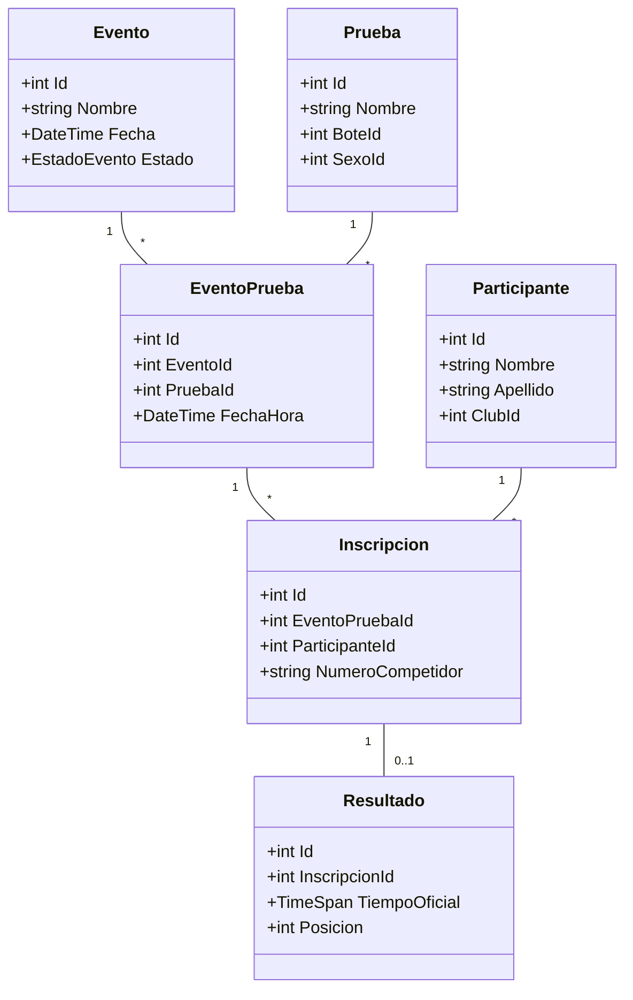
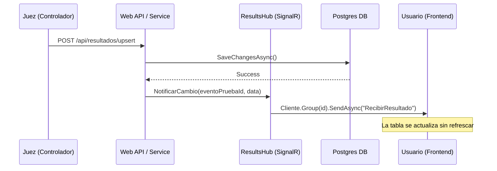
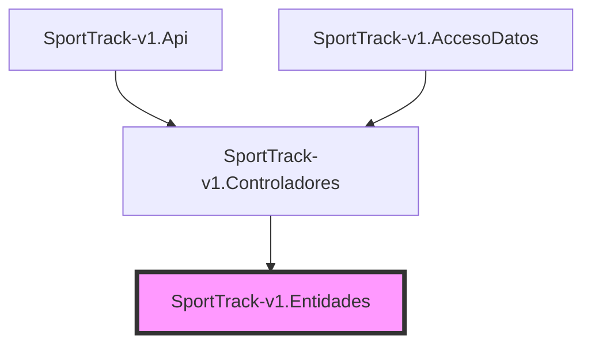

# Arquitectura y Diagramas de Sistema

En este documento se visualiza la estructura lógica y el comportamiento del sistema SportTrack-v1.

## 1. Diagrama de Clases (Simplificado)
Relaciones principales entre las entidades del corazón del sistema.



## 2. Diagrama de Casos de Uso
Interacción de los actores con el sistema.

```mermaid
useCaseDiagram
    participant Publico
    participant Club
    participant Admin

    Publico --> (Ver Eventos Próximos)
    Publico --> (Ver Resultados en TR)
    
    Club --> (Login)
    Club --> (Registrar Atletas)
    Club --> (Inscribir a Carreras)
    
    Admin --> (Gestionar Eventos)
    Admin --> (Cargar Resultados Oficiales)
    Admin --> (Gestionar Calendario)
```

## 3. Flujo de Comunicación Real-Time (SignalR)
Secuencia de eventos desde que se carga un tiempo hasta que el usuario lo ve.



## 4. Estructura de Capas (Onion)
Representación visual de la dependencia de dependencias.


