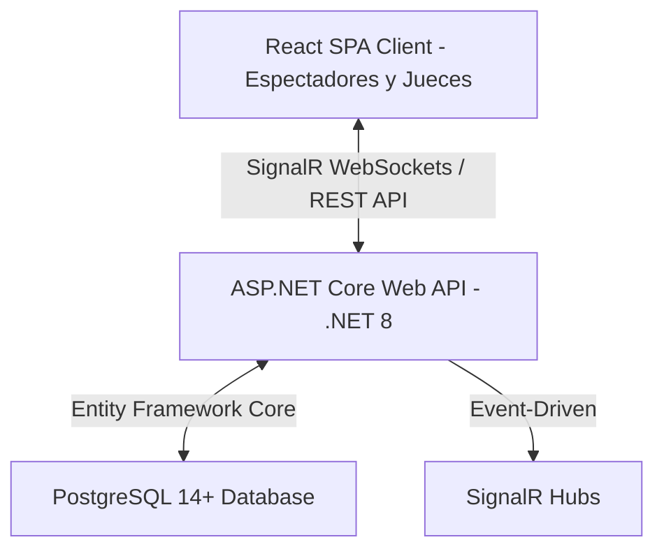

# Presentación del Stack Tecnológico y Ventajas Competitivas — SportTrack-v1

Este documento detalla los fundamentos de la selección de nuestro ecosistema tecnológico de desarrollo, justificando la elección de cada componente clave y analizando las ventajas competitivas que diferencian a **SportTrack-v1** frente a las alternativas tradicionales del mercado de cronometraje deportivo.

---

## 1. El Ecosistema Elegido: Sinopsis del Stack

Para dar soporte a competencias deportivas de alto rendimiento con alta concurrencia de público, elegimos un stack tecnológico moderno, robusto y altamente escalable:

- **Frontend**: React (SPA con Vanilla CSS, Lucide Icons y Tailwind opcional).
- **Backend**: C# / .NET 8 (ASP.NET Core Web API) estructurado con Arquitectura de Cebolla.
- **Base de Datos**: PostgreSQL 14+.
- **Comunicación en Tiempo Real**: ASP.NET Core SignalR (WebSockets con fallback automático).

---

## 2. Justificación Técnica: ¿Por qué elegimos este Stack?

### 🚀 C# y .NET 8: Potencia y Arquitectura Empresarial
* **Rendimiento de Compilación y JIT**: .NET 8 ofrece una de las velocidades de ejecución más rápidas del mercado (según los benchmarks de TechEmpower). La recolección de basura optimizada y la compilación a código de máquina nativo garantizan respuestas de baja latencia ante las solicitudes de cronometraje.
* **Tipado Estricto y Seguridad en Compilación**: A diferencia de lenguajes interpretados dinámicamente (como Node.js/Python), C# previene errores de tipos o referencias nulas en tiempo de compilación. Esto es crítico en un sistema de tiempo real donde el fallo de un segundo puede arruinar la clasificación de una regata.
* **Onion Architecture (Arquitectura de Cebolla)**: La solución se estructura en capas desacopladas (`Entidades`, `AccesoDatos`, `Controladores`, `Api`). Esto permite aislar las reglas de negocio del canotaje de los detalles de infraestructura, garantizando que el sistema sea fácil de probar mediante Unit Tests y sencillo de mantener a largo plazo.

### 🐘 PostgreSQL: Integridad Relacional y Escalabilidad
* **Modelo Relacional Riguroso**: La lógica deportiva es altamente relacional. Un club posee atletas; los atletas se inscriben en inscripciones; estas se agrupan en pruebas compuestas por categorías, tipos de bote y distancias; y estas a su vez se corren en fases (series, semifinales, finales) que generan resultados. PostgreSQL maneja estas relaciones con restricciones de integridad referencial perfectas.
* **Esquemas Lógicos Claros**: Usamos esquemas de base de datos dedicados (`catalogos`, `seguridad`, `regatas`) para organizar físicamente las tablas, facilitando la administración de la base de datos y la seguridad a nivel de datos.
* **Transacciones ACID Robustas**: Durante el cronometraje, múltiples jueces registran tiempos de llegada en paralelo. PostgreSQL garantiza consistencia absoluta (concurrencia sin bloqueos sucios o colisiones de datos) mediante transacciones seguras.
* **Licencia de Código Abierto Corporativa**: Cero costos de licenciamiento (a diferencia de MS SQL Server o Oracle), permitiendo despliegues flexibles tanto On-Premise como en nubes públicas (AWS RDS, Azure Database o Supabase).

### ⚛️ React: Experiencia de Usuario Viva y Fluida
* **Reactividad Instantánea (Virtual DOM)**: Las clasificaciones deportivas cambian en fracciones de segundo. El Virtual DOM de React calcula eficientemente los cambios en la UI y actualiza la tabla de posiciones en tiempo real sin recargar la página.
* **Arquitectura Basada en Componentes**: Permite encapsular la interfaz en piezas modulares y reutilizables (ej: tarjetas de fases `FaseCard`, tablas de resultados, paneles de control para jueces `FinisherDashboard`), asegurando la consistencia estética y facilitando el mantenimiento.
* **Estado Sincronizado**: Permite acoplar de forma limpia las conexiones de datos (SignalR y llamadas REST) directamente con el ciclo de vida de la UI, asegurando que todos los espectadores vean la misma información al mismo tiempo.

### 🔌 SignalR: Telemetría e Instantaneidad Pura
* **WebSockets Bidireccionales**: En lugar de saturar el servidor con miles de peticiones HTTP constantes (Polling tradicional), los clientes abren un canal continuo de comunicación. El servidor empuja los datos al cliente solo cuando hay un cambio.
* **Fallback Automático**: Si el espectador se encuentra en una pista de canotaje rural con mala cobertura telefónica y su dispositivo no soporta WebSockets, SignalR degrada la comunicación automáticamente a *Server-Sent Events* o *Long Polling* sin romper la experiencia.
* **Agrupación Inteligente (Race Rooms)**: Los usuarios solo se unen a la prueba activa mediante grupos en el Hub (`JoinRaceGroup(eventoPruebaId)`). Esto previene que un espectador de la "Serie 1" reciba telemetría innecesaria de la "Serie 2", ahorrando ancho de banda en servidores y dispositivos móviles.

---

## 3. Diferenciación y Ventajas Competitivas con las Competencias

Las plataformas tradicionales de cronometraje y gestión de regatas (como sistemas basados en Excel, *Sportis*, *RaceSplitter* o plataformas web genéricas) presentan limitaciones severas que **SportTrack-v1** resuelve de manera nativa:

| Característica | Sistemas Competidores Tradicionales | SportTrack-v1 | Ventaja de SportTrack-v1 |
| :--- | :--- | :--- | :--- |
| **Latencia de Resultados** | Resultados subidos al final de la jornada en formato PDF o Excel estático. | **Streaming en tiempo real (milisegundos)** por WebSockets. | Los clubes, entrenadores y público ven los tiempos de paso y de llegada en vivo mientras transcurre el evento. |
| **Resiliencia ante Cortes de Conexión** | Pérdida de datos si se cae la red o el navegador se refresca. | **Sincronización híbrida** (WebSockets + Polling robusto fallback). | Si un dispositivo pierde señal momentáneamente, se re-conecta automáticamente y recupera los datos perdidos del estado de la base de datos. |
| **Modelado Deportivo** | Tablas genéricas adaptadas a la fuerza (requieren configuraciones manuales complejas). | **Modelado semántico nativo** (Canotaje: K1, K2, C1, clasificaciones oficiales por fase). | El sistema entiende de forma nativa la progresión de Heats/Series a Semifinales y Finales del canotaje, automatizando los pases de ronda. |
| **Colaboración Multi-Rol** | Un solo operador a la vez. Riesgo de sobreescribir datos o bloqueos del sistema. | **Dashboards simultáneos dedicados** (Largador, Cronometrador, Juez de Mesa, Espectadores). | Múltiples operadores trabajan en paralelo con mínima latencia sin interferir en el flujo de los demás. |
| **Arquitectura de Software** | Código en bloque ("Monolito de espagueti") o macros de escritorio difíciles de actualizar. | **Clean Architecture (Onion)** y APIs REST estructuradas. | Altamente mantenible y escalable para transformarse en un software SaaS bajo demanda. |

---

## 4. Conclusión: El Retorno de Inversión Tecnológico

La combinación de **.NET 8**, **PostgreSQL**, **React** y **SignalR** no es casualidad. Representa un balance perfecto entre la **solidez empresarial en el almacenamiento y procesamiento de datos** y la **agilidad extrema y moderna en la interacción del usuario**.

**SportTrack-v1** no es solo un registrador de tiempos; es una plataforma de eventos en vivo que convierte una competencia deportiva en una experiencia interactiva digital de clase mundial, elevando el valor comercial del evento y la satisfacción de atletas, clubes y patrocinadores.
