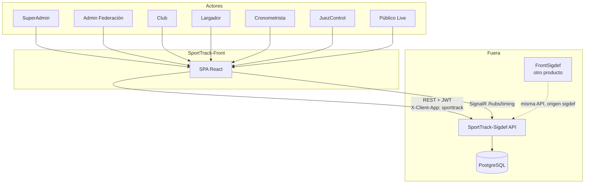
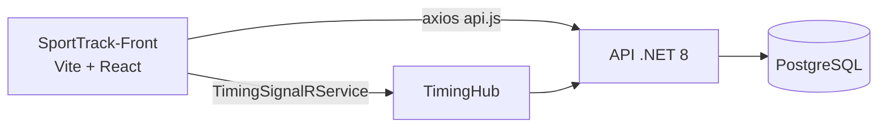
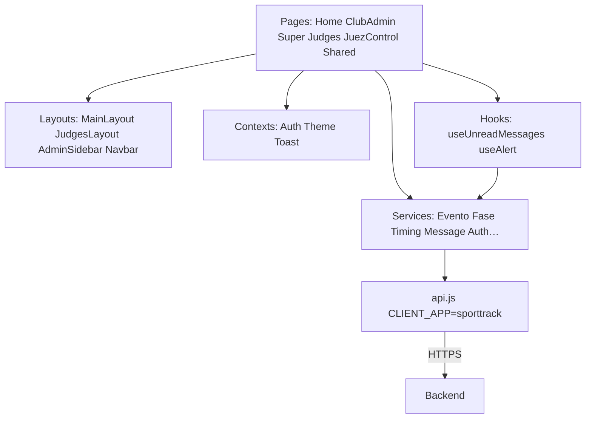
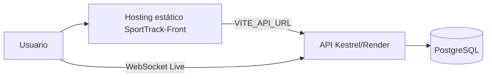
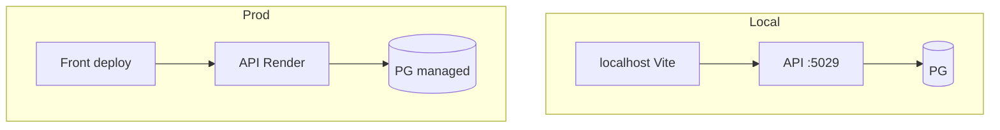
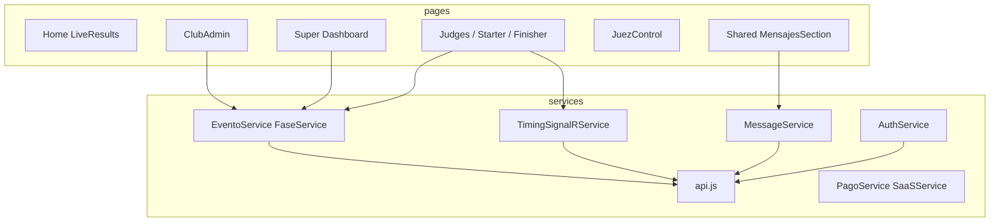
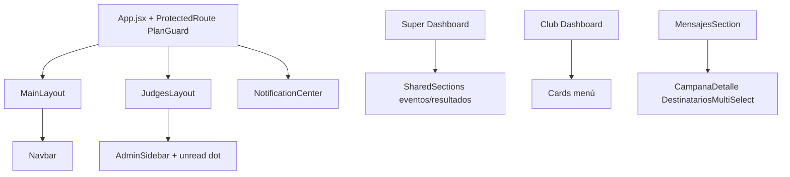

# 01 — Globales (SportTrack-Front)

## 1. Contexto

---

## 2. Contenedores

---

## 3. Capas (este front)

---

## 4. Despliegue

---

## 5. Despliegue detallado

---

## 6. Paquetes / módulos front

---

## 7. Componentes UI

