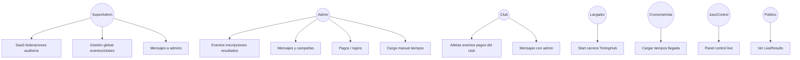
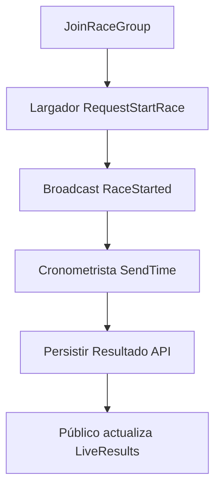
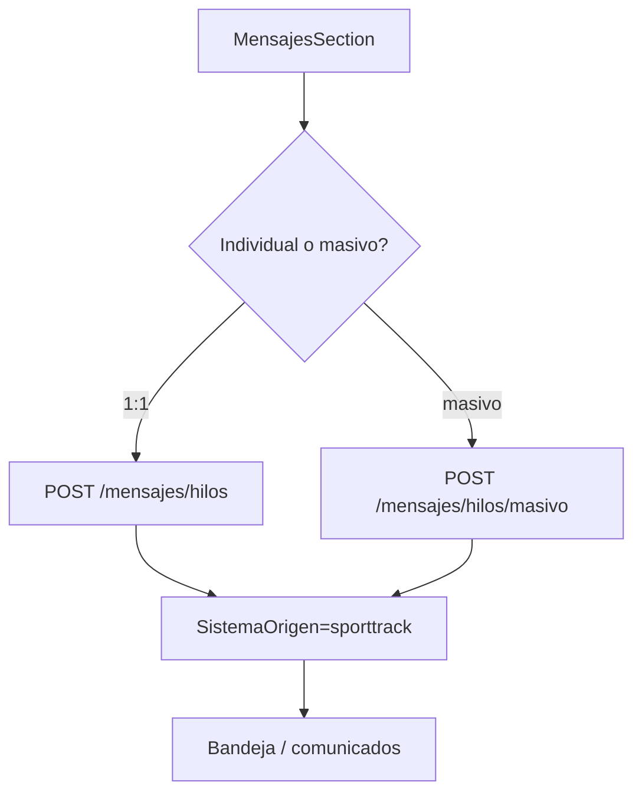
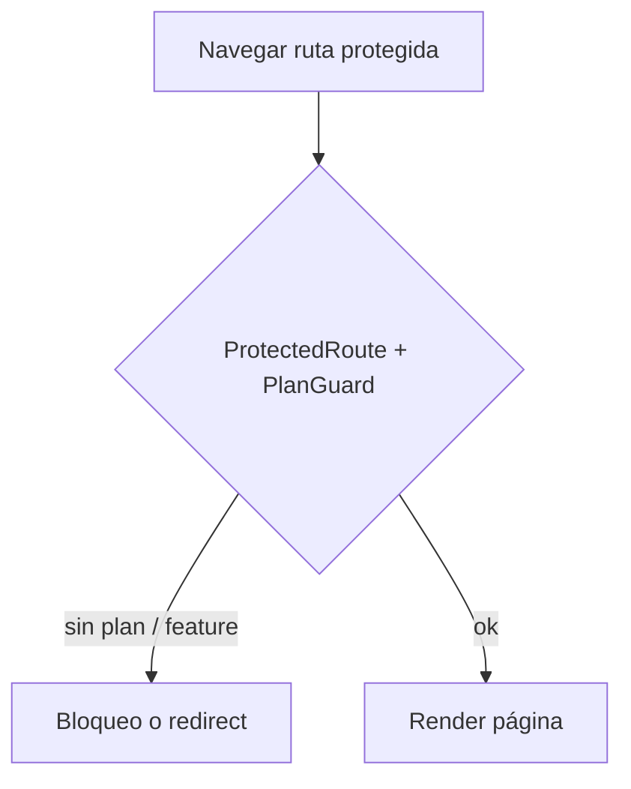
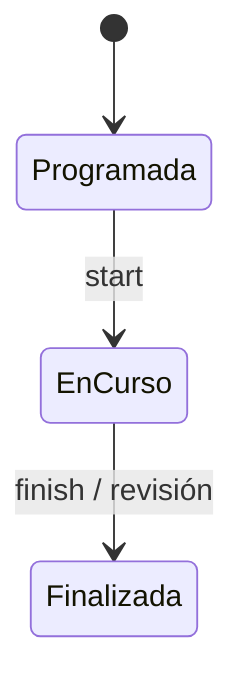
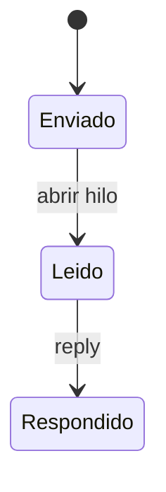
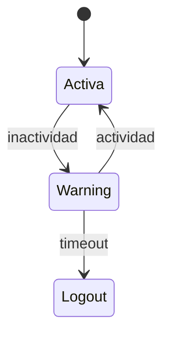

# 02 — Casos de uso, actividad y estados (SportTrack-Front)

## 1. Casos de uso



---

## 2. Actividad

### Login → redirect por rol

```mermaid
flowchart TD
    A[Login] --> B{Rol}
    B -->|SuperAdmin/Admin| C[/super o /admin]
    B -->|Club| D[/club]
    B -->|Largador| E[/jueces/largador]
    B -->|Cronometrista| F[/jueces/llegada]
    B -->|JuezControl| G[/juez-control]
```

### Flujo carrera (jueces + público)



### Mensaje / campaña SportTrack



### Guard de plan SaaS



---

## 3. Estados

### Fase (UI jueces)



### Mensaje



### Sesión jueces (JudgesLayout)


