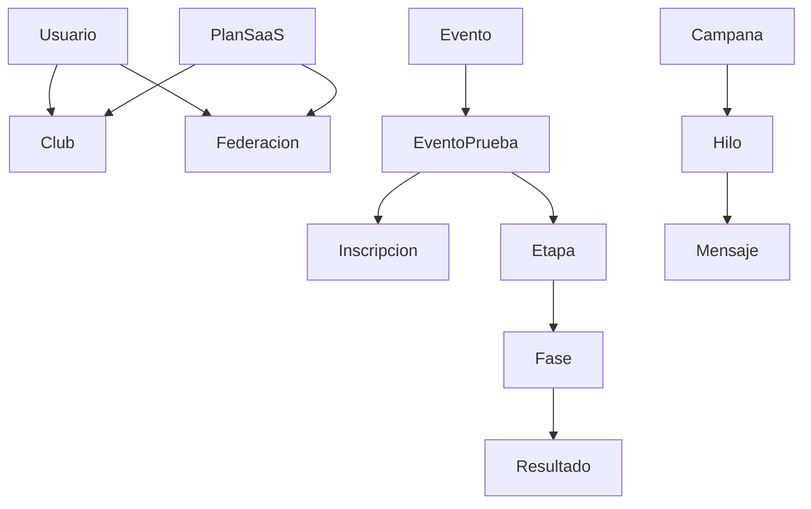
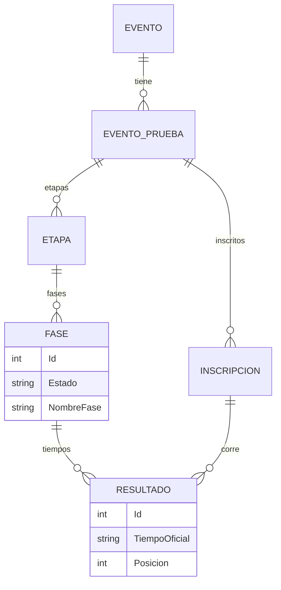
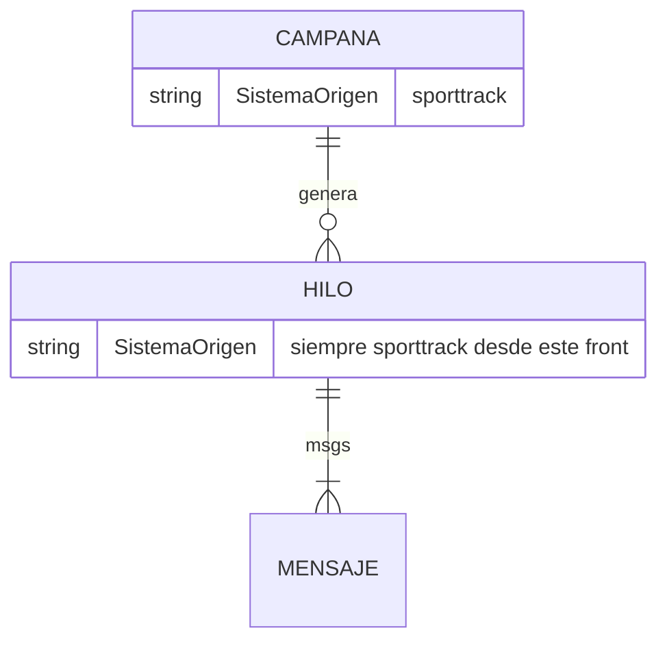
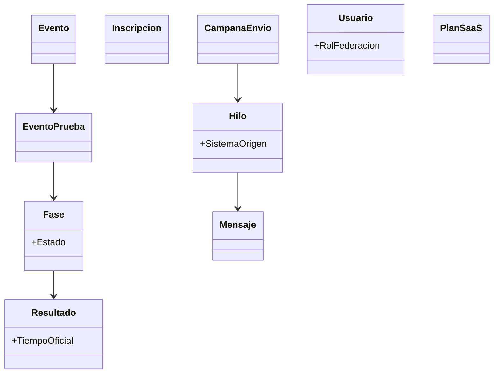

# 03 — Dominio visto desde SportTrack-Front

Este front **no define** el schema SQL. El ER canónico está en:

**SportTrack-Sigdef** → `docs/tecnico/diagramas/03-er-clases-dominio.md`

Aquí: entidades que la UI usa vía services, y el recorte de mensajería con origen `sporttrack`.

---

## 1. Mapa conceptual consumido

---

## 2. ER lógico — timing (vista UI)

---

## 3. ER lógico — mensajería SportTrack

Header fijo en `api.js`: `X-Client-App: sporttrack`. Los hilos `sigdef` **no** aparecen en esta bandeja.

---

## 4. Clases de dominio relevantes (consumo)

---

## 5. Roles en UI vs API

| Rol UI | Rutas típicas |
|--------|----------------|
| SuperAdmin / Admin | `/super/*`, `/admin/*`, `/jueces/*` |
| Club | `/club/*` |
| Largador | `/jueces/largador` |
| Cronometrista | `/jueces/llegada` |
| JuezControl | `/juez-control/*` |
| Anónimo | `/`, `/resultados/:id`, Live |
