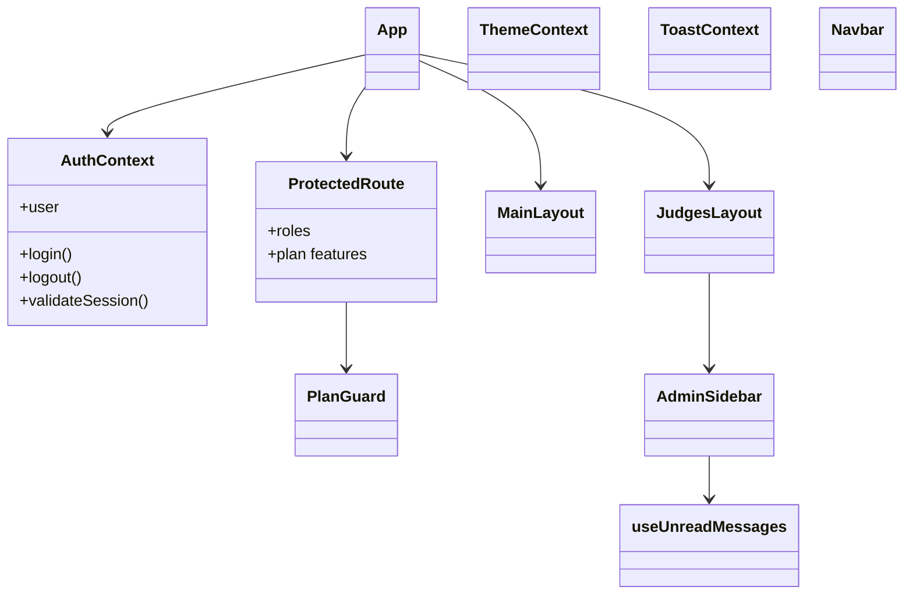
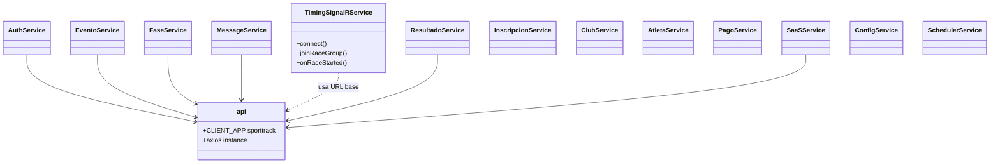
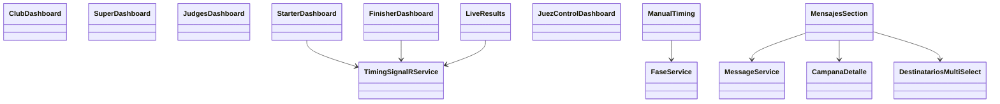
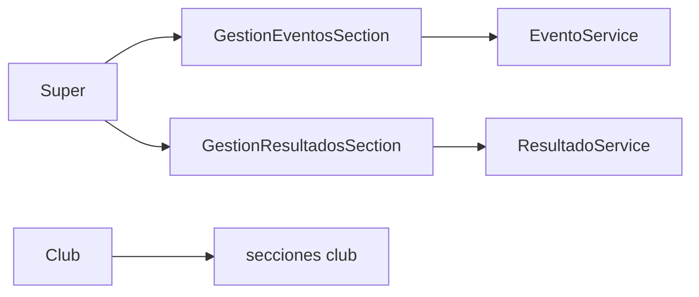

# 04 — Clases de aplicación (SportTrack-Front)

## 1. Shell / auth

```mermaid
classDiagram
    class App
    class AuthContext {
        +user
        +login()
        +logout()
        +validateSession()
    }
    class ThemeContext
    class ToastContext
    class ProtectedRoute {
        +roles
        +plan features
    }
    class PlanGuard
    class MainLayout
    class JudgesLayout
    class AdminSidebar
    class Navbar
    class useUnreadMessages

    App --> AuthContext
    App --> ProtectedRoute
    ProtectedRoute --> PlanGuard
    App --> MainLayout
    App --> JudgesLayout
    JudgesLayout --> AdminSidebar
    AdminSidebar --> useUnreadMessages
```

---

## 2. Services

```mermaid
classDiagram
    class api {
        +CLIENT_APP sporttrack
        +axios instance
    }
    class AuthService
    class EventoService
    class FaseService
    class TimingSignalRService {
        +connect()
        +joinRaceGroup()
        +onRaceStarted()
    }
    class MessageService
    class ResultadoService
    class InscripcionService
    class ClubService
    class AtletaService
    class PagoService
    class SaaSService
    class ConfigService
    class SchedulerService

    AuthService --> api
    EventoService --> api
    FaseService --> api
    MessageService --> api
    TimingSignalRService ..> api : usa URL base
    ResultadoService --> api
    SaaSService --> api
```

---

## 3. Páginas por rol

```mermaid
classDiagram
    class ClubDashboard
    class SuperDashboard
    class JudgesDashboard
    class StarterDashboard
    class FinisherDashboard
    class ManualTiming
    class JuezControlDashboard
    class LiveResults
    class MensajesSection
    class CampanaDetalle
    class DestinatariosMultiSelect

    StarterDashboard --> TimingSignalRService
    FinisherDashboard --> TimingSignalRService
    ManualTiming --> FaseService
    MensajesSection --> MessageService
    MensajesSection --> CampanaDetalle
    MensajesSection --> DestinatariosMultiSelect
    LiveResults --> TimingSignalRService
```

---

## 4. Shared sections (admin)

```mermaid
flowchart LR
    Super --> GE[GestionEventosSection]
    Super --> GR[GestionResultadosSection]
    Club --> GE2[secciones club]
    GE --> EventoService
    GR --> ResultadoService
```
