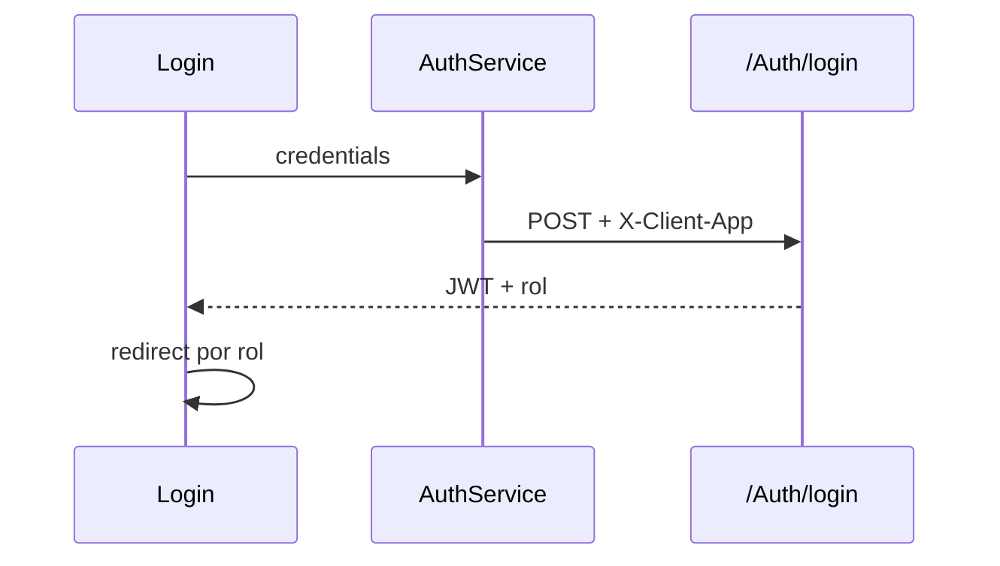
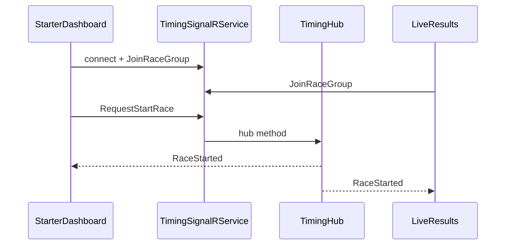
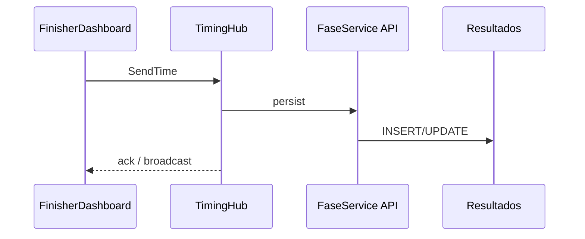
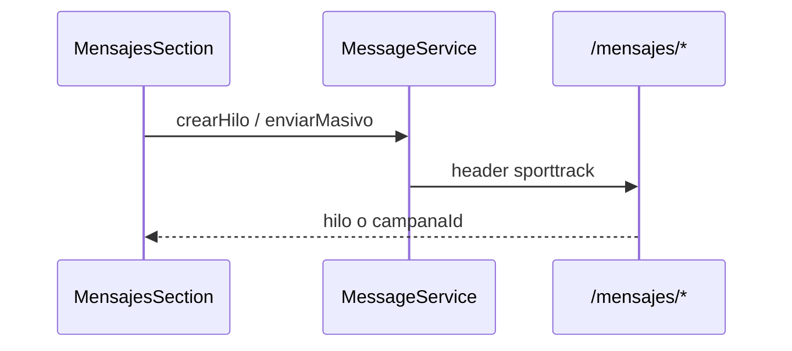
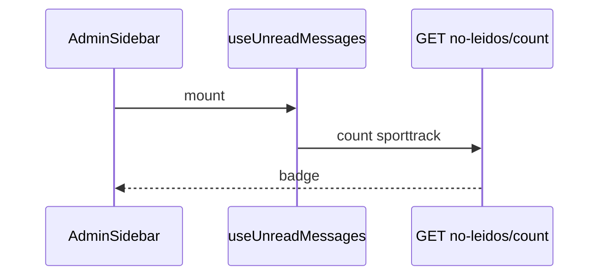
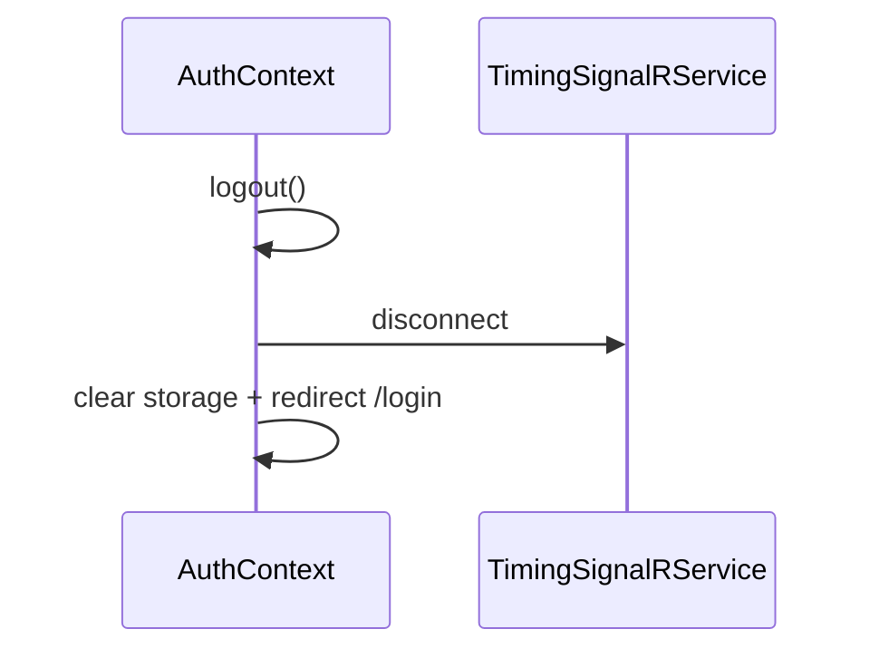
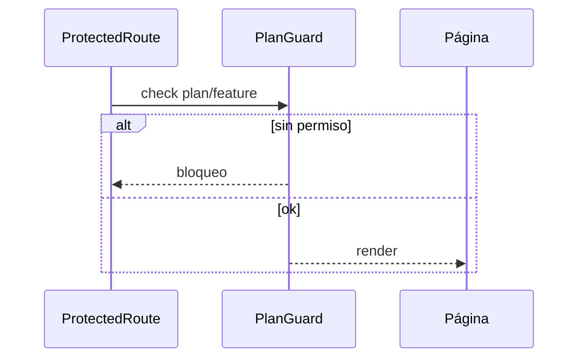

# 05 — Secuencias y red (SportTrack-Front)

## Red / API

```mermaid
flowchart LR
    ST[SportTrack-Front] -->|Bearer + X-Client-App: sporttrack| API
    ST -->|WebSocket| HUB[/hubs/timing]
    SIG[FrontSigdef] -->|X-Client-App: sigdef| API
    API --> DB[(PostgreSQL)]
```

| Cliente | Header | Bandeja mensajes |
|---------|--------|------------------|
| Este repo | `sporttrack` | Solo origen sporttrack |
| FrontSigdef | `sigdef` | Solo origen sigdef |

---

## 1. Login



---

## 2. Start carrera + Live



---

## 3. Enviar tiempo



---

## 4. Mensajería 1:1 / masivo



---

## 5. Unread badge sidebar



---

## 6. Logout corta SignalR



---

## 7. PlanGuard bloquea feature


